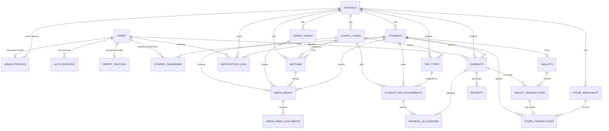
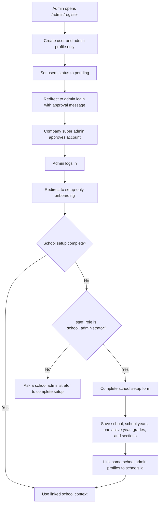
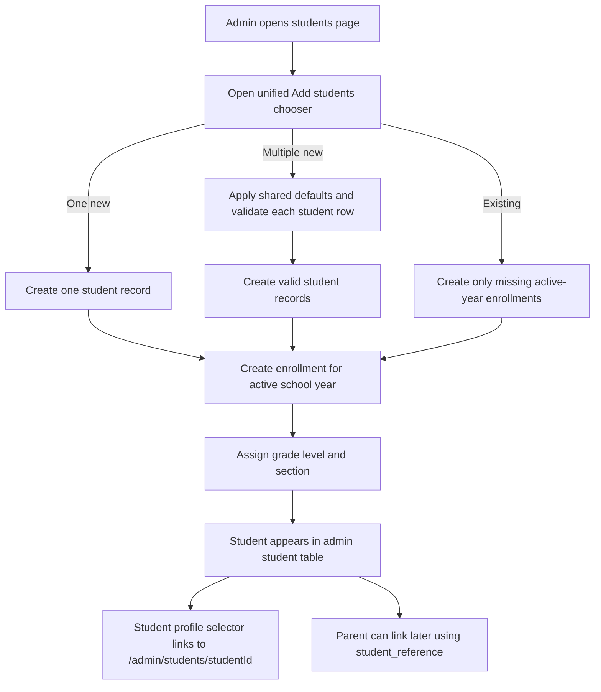
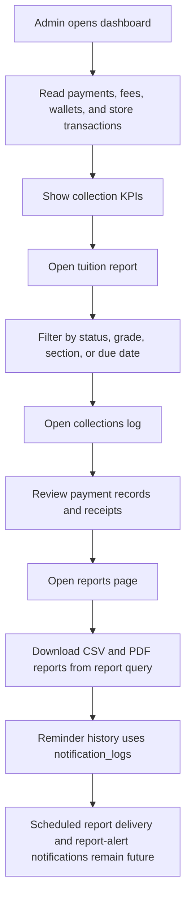
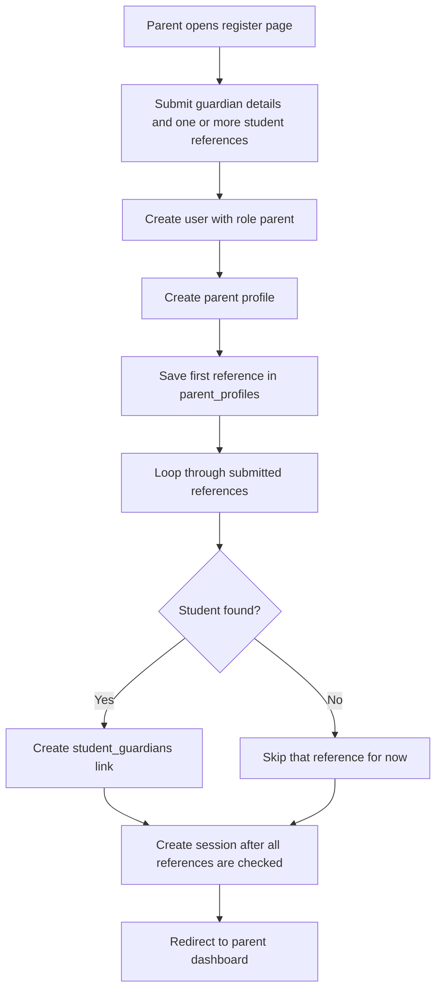
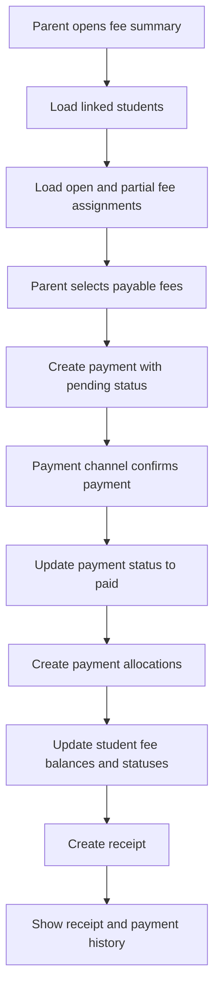
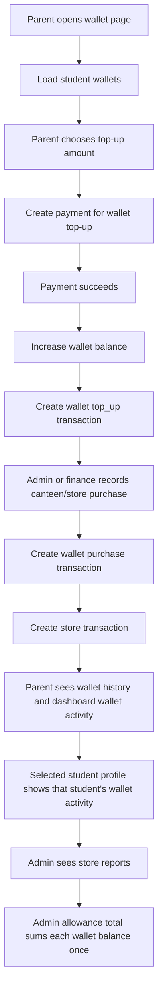

# XMETA Pay Database Schema Plan

## Project Database Overview

XMETA Pay uses one MySQL database for three connected access areas:

- Company super admin: XMETA Pay monitoring for schools and school admin account access.
- Admin/school portal: school setup, student records, parent directory, tuition, collections, allowance, store transactions, and reports.
- Parent portal: registration, student linking by reference, linked enrolled student access, fee viewing, tuition payment, receipts, payment history, wallet top-up, dashboard wallet activity, selected student wallet activity, and full wallet/store-spending history.

Related role guide: `ADMIN_ROLES.md` explains the company `super_admin` role plus the `school_administrator`, `registrar`, and `finance_officer` permissions used by the admin/school portal.

The current database already starts with shared authentication tables. The practical MVP should keep that foundation and add school, student, enrollment, billing, payment, wallet, and reporting tables around it.

Recommended database defaults for XAMPP MySQL:

```sql
CREATE DATABASE IF NOT EXISTS xmetapay_db
  CHARACTER SET utf8mb4
  COLLATE utf8mb4_unicode_ci;

USE xmetapay_db;
```

All tables should use:

```sql
ENGINE=InnoDB DEFAULT CHARSET=utf8mb4 COLLATE=utf8mb4_unicode_ci
```

## Current Auth Schema Recap

The existing auth design is still the correct foundation.

### `users`

Shared login table for company super admin, school admin, and parent accounts.

| Column | Purpose |
| --- | --- |
| `id` | Primary key |
| `role` | `super_admin`, `admin`, or `parent` |
| `name` | Display name |
| `email` | Login/contact email |
| `phone` | Optional login/contact phone |
| `password_hash` | Hashed password only |
| `status` | `active`, `pending`, or `disabled`; school admin registration starts as `pending` until company super admin approval |
| `last_login_at` | Last successful login time |
| `created_at`, `updated_at` | Audit timestamps |

Important indexes:

```sql
UNIQUE KEY uq_users_role_email (role, email),
UNIQUE KEY uq_users_role_phone (role, phone),
KEY idx_users_role_status (role, status),
KEY idx_users_created_at (created_at)
```

### `auth_sessions`

Server-managed sessions for public web auth.

| Column | Purpose |
| --- | --- |
| `id` | Primary key |
| `user_id` | Links to `users.id` |
| `role` | Session role: `super_admin`, `admin`, or `parent` |
| `token_hash` | HMAC hash of the browser session token |
| `expires_at` | Session expiry time |
| `last_used_at` | Last valid session read |
| `revoked_at` | Logout/revocation timestamp |
| `created_at` | Creation timestamp |

Important indexes:

```sql
UNIQUE KEY uq_auth_sessions_token_hash (token_hash),
KEY idx_auth_sessions_user_revoked_expires (user_id, revoked_at, expires_at),
KEY idx_auth_sessions_role_expires (role, expires_at)
```

### `admin_profiles`

One admin profile per admin user.

| Column | Purpose |
| --- | --- |
| `id` | Primary key |
| `user_id` | Links to `users.id` |
| `school_id` | Nullable link to `schools.id` after school setup is initialized |
| `school_name` | School name captured during admin registration |
| `staff_role` | Admin staff permission: `school_administrator`, `registrar`, or `finance_officer` |

Implementation note: `school_name` stays for display, registration history, and fallback matching. After the full schema is imported, a `school_administrator` manually sets up school records and links the admin profile to the real `schools.id` record through `admin_profiles.school_id`. The setup is school-wide: registrar and finance officer profiles with the same exact `school_name` are also linked to that same `schools.id` so they can share the completed school context instead of setting up the school again.

### `parent_profiles`

One parent profile per parent user.

| Column | Purpose |
| --- | --- |
| `id` | Primary key |
| `user_id` | Links to `users.id` |
| `student_name` | Pending-link display label; parent registration stores the first submitted student reference here until an official student link exists |
| `student_reference` | First student reference captured during registration; all submitted references attempt `student_guardians` links |
| `relationship` | Mother, father, or guardian |

## Full Practical MVP Schema

The following tables extend the current auth schema into the full dashboard and parent portal data model.

### School Setup

#### `schools`

Stores schools using XMETA Pay.

```sql
CREATE TABLE schools (
  id BIGINT UNSIGNED AUTO_INCREMENT PRIMARY KEY,
  name VARCHAR(180) NOT NULL,
  code VARCHAR(40) NOT NULL,
  status ENUM('active', 'inactive') NOT NULL DEFAULT 'active',
  created_at DATETIME NOT NULL DEFAULT CURRENT_TIMESTAMP,
  updated_at DATETIME NOT NULL DEFAULT CURRENT_TIMESTAMP ON UPDATE CURRENT_TIMESTAMP,

  UNIQUE KEY uq_schools_code (code),
  KEY idx_schools_status (status)
);
```

#### `school_years`

Stores one or many school years per school. One row should be `active` for the live dashboard, future rows can be `upcoming`, and old rows can be `closed`. The overview-first setup hub and focused year-structure/rollover routes reuse these records, so the management UX adds no table or column. Activation turns an upcoming year into the active year and closes the previous active year.

```sql
CREATE TABLE school_years (
  id BIGINT UNSIGNED AUTO_INCREMENT PRIMARY KEY,
  school_id BIGINT UNSIGNED NOT NULL,
  name VARCHAR(40) NOT NULL,
  starts_on DATE NOT NULL,
  ends_on DATE NOT NULL,
  status ENUM('upcoming', 'active', 'closed') NOT NULL DEFAULT 'active',
  created_at DATETIME NOT NULL DEFAULT CURRENT_TIMESTAMP,
  updated_at DATETIME NOT NULL DEFAULT CURRENT_TIMESTAMP ON UPDATE CURRENT_TIMESTAMP,

  UNIQUE KEY uq_school_years_school_name (school_id, name),
  KEY idx_school_years_school_status (school_id, status),
  CONSTRAINT fk_school_years_school FOREIGN KEY (school_id) REFERENCES schools(id)
);
```

#### `grade_levels`

Stores grade levels per school.

```sql
CREATE TABLE grade_levels (
  id BIGINT UNSIGNED AUTO_INCREMENT PRIMARY KEY,
  school_id BIGINT UNSIGNED NOT NULL,
  name VARCHAR(60) NOT NULL,
  sort_order SMALLINT UNSIGNED NOT NULL DEFAULT 0,

  UNIQUE KEY uq_grade_levels_school_name (school_id, name),
  KEY idx_grade_levels_school_order (school_id, sort_order),
  CONSTRAINT fk_grade_levels_school FOREIGN KEY (school_id) REFERENCES schools(id)
);
```

#### `sections`

Stores class sections per grade level and school year.

```sql
CREATE TABLE sections (
  id BIGINT UNSIGNED AUTO_INCREMENT PRIMARY KEY,
  school_id BIGINT UNSIGNED NOT NULL,
  school_year_id BIGINT UNSIGNED NOT NULL,
  grade_level_id BIGINT UNSIGNED NOT NULL,
  name VARCHAR(60) NOT NULL,

  UNIQUE KEY uq_sections_year_grade_name (school_year_id, grade_level_id, name),
  KEY idx_sections_school_year (school_id, school_year_id),
  CONSTRAINT fk_sections_school FOREIGN KEY (school_id) REFERENCES schools(id),
  CONSTRAINT fk_sections_school_year FOREIGN KEY (school_year_id) REFERENCES school_years(id),
  CONSTRAINT fk_sections_grade_level FOREIGN KEY (grade_level_id) REFERENCES grade_levels(id)
);
```

### Student Records

#### `students`

Stores each student profile.

```sql
CREATE TABLE students (
  id BIGINT UNSIGNED AUTO_INCREMENT PRIMARY KEY,
  school_id BIGINT UNSIGNED NOT NULL,
  student_reference VARCHAR(60) NOT NULL,
  first_name VARCHAR(80) NOT NULL,
  middle_name VARCHAR(80) NULL,
  last_name VARCHAR(80) NOT NULL,
  birthdate DATE NULL,
  sex ENUM('male', 'female') NULL,
  status ENUM('active', 'inactive', 'graduated', 'transferred') NOT NULL DEFAULT 'active',
  created_at DATETIME NOT NULL DEFAULT CURRENT_TIMESTAMP,
  updated_at DATETIME NOT NULL DEFAULT CURRENT_TIMESTAMP ON UPDATE CURRENT_TIMESTAMP,

  UNIQUE KEY uq_students_school_reference (school_id, student_reference),
  KEY idx_students_school_status (school_id, status),
  KEY idx_students_name (last_name, first_name),
  CONSTRAINT fk_students_school FOREIGN KEY (school_id) REFERENCES schools(id)
);
```

#### `student_guardians`

Links parent accounts to students. This supports multiple guardians per student and multiple students per parent. Parent registration can submit one or more student references and creates one row per matched student; later, the parent portal can add more children by creating additional rows here. The unique pair key keeps duplicate links from being created.

```sql
CREATE TABLE student_guardians (
  id BIGINT UNSIGNED AUTO_INCREMENT PRIMARY KEY,
  student_id BIGINT UNSIGNED NOT NULL,
  parent_user_id BIGINT UNSIGNED NOT NULL,
  relationship ENUM('mother', 'father', 'guardian') NOT NULL,
  is_primary BOOLEAN NOT NULL DEFAULT FALSE,
  created_at DATETIME NOT NULL DEFAULT CURRENT_TIMESTAMP,

  UNIQUE KEY uq_student_guardians_pair (student_id, parent_user_id),
  KEY idx_student_guardians_parent (parent_user_id),
  KEY idx_student_guardians_student_primary (student_id, is_primary),
  CONSTRAINT fk_student_guardians_student FOREIGN KEY (student_id) REFERENCES students(id) ON DELETE CASCADE,
  CONSTRAINT fk_student_guardians_parent FOREIGN KEY (parent_user_id) REFERENCES users(id) ON DELETE CASCADE
);
```

### Enrollment

#### `enrollments`

Stores a student's enrollment per school year.

The school-year rollover workflow lets an administrator explicitly select one or many source-year students, review per-student promote, repeat, or skip decisions, and insert new target-year enrollments only for checked promote/repeat rows. The shared `students` record and all year-specific fee, payment, wallet, store, and reminder records remain separate.

The admin uses one Add students chooser for three focused workflows: one new student, multiple new students with optional shared grade/section/student-type defaults and per-row overrides, or one/many existing Pending students. Existing-student enrollment creates only missing `enrollments` rows and never inserts a second `students` row or re-enters identity and guardian-link data. This workflow organization requires no schema change.

```sql
CREATE TABLE enrollments (
  id BIGINT UNSIGNED AUTO_INCREMENT PRIMARY KEY,
  student_id BIGINT UNSIGNED NOT NULL,
  school_year_id BIGINT UNSIGNED NOT NULL,
  grade_level_id BIGINT UNSIGNED NOT NULL,
  section_id BIGINT UNSIGNED NULL,
  student_type ENUM('new', 'transferee', 'returned') NULL,
  status ENUM('draft', 'submitted', 'enrolled', 'rejected', 'withdrawn') NOT NULL DEFAULT 'draft',
  submitted_at DATETIME NULL,
  enrolled_at DATETIME NULL,
  created_at DATETIME NOT NULL DEFAULT CURRENT_TIMESTAMP,
  updated_at DATETIME NOT NULL DEFAULT CURRENT_TIMESTAMP ON UPDATE CURRENT_TIMESTAMP,

  UNIQUE KEY uq_enrollments_student_year (student_id, school_year_id),
  KEY idx_enrollments_year_status (school_year_id, status),
  KEY idx_enrollments_grade_section (grade_level_id, section_id),
  CONSTRAINT fk_enrollments_student FOREIGN KEY (student_id) REFERENCES students(id) ON DELETE CASCADE,
  CONSTRAINT fk_enrollments_school_year FOREIGN KEY (school_year_id) REFERENCES school_years(id),
  CONSTRAINT fk_enrollments_grade_level FOREIGN KEY (grade_level_id) REFERENCES grade_levels(id),
  CONSTRAINT fk_enrollments_section FOREIGN KEY (section_id) REFERENCES sections(id)
);
```

`students.sex` is reusable student-master data. `enrollments.student_type` is specific to the school year, so a student can be `new`, `transferee`, or `returned` in different years. Existing null values remain valid and display as `Pending`; age is calculated from `birthdate` and is never stored.

#### `enrollment_documents`

Tracks required enrollment document submissions.

```sql
CREATE TABLE enrollment_documents (
  id BIGINT UNSIGNED AUTO_INCREMENT PRIMARY KEY,
  enrollment_id BIGINT UNSIGNED NOT NULL,
  document_type VARCHAR(80) NOT NULL,
  file_name VARCHAR(180) NULL,
  status ENUM('missing', 'submitted', 'approved', 'rejected') NOT NULL DEFAULT 'missing',
  submitted_at DATETIME NULL,
  reviewed_at DATETIME NULL,

  KEY idx_enrollment_documents_enrollment_status (enrollment_id, status),
  CONSTRAINT fk_enrollment_documents_enrollment FOREIGN KEY (enrollment_id) REFERENCES enrollments(id) ON DELETE CASCADE
);
```

### Fees And Billing

#### `fee_types`

Defines tuition and other school fees. Current MVP tuition installments are managed per student assignment through `tuition_payment_terms`; `fee_type_term_templates` remains in the schema as a reserved future template layer.

```sql
CREATE TABLE fee_types (
  id BIGINT UNSIGNED AUTO_INCREMENT PRIMARY KEY,
  school_id BIGINT UNSIGNED NOT NULL,
  school_year_id BIGINT UNSIGNED NOT NULL,
  name VARCHAR(120) NOT NULL,
  category ENUM('tuition', 'other', 'allowance') NOT NULL,
  default_amount DECIMAL(10,2) NOT NULL DEFAULT 0.00,
  status ENUM('active', 'inactive') NOT NULL DEFAULT 'active',
  created_at DATETIME NOT NULL DEFAULT CURRENT_TIMESTAMP,
  updated_at DATETIME NOT NULL DEFAULT CURRENT_TIMESTAMP ON UPDATE CURRENT_TIMESTAMP,

  UNIQUE KEY uq_fee_types_year_name (school_year_id, name),
  KEY idx_fee_types_school_category_status (school_id, category, status),
  CONSTRAINT fk_fee_types_school FOREIGN KEY (school_id) REFERENCES schools(id),
  CONSTRAINT fk_fee_types_school_year FOREIGN KEY (school_year_id) REFERENCES school_years(id)
);
```

#### `fee_type_term_templates`

Stores reusable tuition payment term templates for a tuition fee type. This table is reserved for future template reuse; the current MVP does not expose template inputs in the Add fee type modal and does not auto-create terms during fee assignment. Admin/finance creates final per-student schedules through row-level Manage terms.

```sql
CREATE TABLE fee_type_term_templates (
  id BIGINT UNSIGNED AUTO_INCREMENT PRIMARY KEY,
  fee_type_id BIGINT UNSIGNED NOT NULL,
  term_name VARCHAR(120) NOT NULL,
  sort_order INT UNSIGNED NOT NULL,
  amount_due DECIMAL(10,2) NOT NULL,
  due_date DATE NOT NULL,
  created_at DATETIME NOT NULL DEFAULT CURRENT_TIMESTAMP,
  updated_at DATETIME NOT NULL DEFAULT CURRENT_TIMESTAMP ON UPDATE CURRENT_TIMESTAMP,

  UNIQUE KEY uq_fee_type_term_templates_order (fee_type_id, sort_order),
  UNIQUE KEY uq_fee_type_term_templates_name (fee_type_id, term_name),
  KEY idx_fee_type_term_templates_fee_type (fee_type_id),
  CONSTRAINT fk_fee_type_term_templates_fee_type FOREIGN KEY (fee_type_id) REFERENCES fee_types(id) ON DELETE CASCADE
);
```

#### `student_fee_assignments`

Assigns fees to students and tracks balances. The admin UI can assign one fee type to one or more selected enrolled students; the unique key prevents duplicate charges for the same student, fee type, and school year.

```sql
CREATE TABLE student_fee_assignments (
  id BIGINT UNSIGNED AUTO_INCREMENT PRIMARY KEY,
  student_id BIGINT UNSIGNED NOT NULL,
  fee_type_id BIGINT UNSIGNED NOT NULL,
  school_year_id BIGINT UNSIGNED NOT NULL,
  amount_due DECIMAL(10,2) NOT NULL,
  amount_paid DECIMAL(10,2) NOT NULL DEFAULT 0.00,
  due_date DATE NULL,
  status ENUM('open', 'partial', 'paid', 'cancelled') NOT NULL DEFAULT 'open',
  created_at DATETIME NOT NULL DEFAULT CURRENT_TIMESTAMP,
  updated_at DATETIME NOT NULL DEFAULT CURRENT_TIMESTAMP ON UPDATE CURRENT_TIMESTAMP,

  UNIQUE KEY uq_student_fee_assignments_student_fee_year (student_id, fee_type_id, school_year_id),
  KEY idx_student_fee_assignments_student_status_due (student_id, status, due_date),
  KEY idx_student_fee_assignments_year_status_due (school_year_id, status, due_date),
  CONSTRAINT fk_student_fee_assignments_student FOREIGN KEY (student_id) REFERENCES students(id) ON DELETE CASCADE,
  CONSTRAINT fk_student_fee_assignments_fee_type FOREIGN KEY (fee_type_id) REFERENCES fee_types(id),
  CONSTRAINT fk_student_fee_assignments_school_year FOREIGN KEY (school_year_id) REFERENCES school_years(id)
);
```

#### `parent_fee_summary_archives`

Keeps reversible Fee summary organization private to each parent account. It never changes the fee assignment or another guardian's view.

```sql
CREATE TABLE parent_fee_summary_archives (
  parent_user_id BIGINT UNSIGNED NOT NULL,
  student_fee_assignment_id BIGINT UNSIGNED NOT NULL,
  archived_at DATETIME NOT NULL DEFAULT CURRENT_TIMESTAMP,

  PRIMARY KEY (parent_user_id, student_fee_assignment_id),
  KEY idx_parent_fee_archives_parent_archived_assignment (parent_user_id, archived_at, student_fee_assignment_id),
  KEY idx_parent_fee_archives_assignment (student_fee_assignment_id),
  CONSTRAINT fk_parent_fee_archives_parent FOREIGN KEY (parent_user_id) REFERENCES users(id) ON DELETE CASCADE,
  CONSTRAINT fk_parent_fee_archives_assignment FOREIGN KEY (student_fee_assignment_id) REFERENCES student_fee_assignments(id) ON DELETE CASCADE
);
```

The parent portal permits archiving only paid or zero-balance assignments. KPIs, payable counts, admin reports, receipts, payment history, and tuition terms continue reading the authoritative fee and payment tables.

#### `tuition_payment_terms`

Stores per-student tuition installment schedules. These apply only to tuition assignments; other fees remain normal fee assignments. The application keeps tuition term validation, payable checks, payment application, and assignment recalculation in one shared server-only helper for maintainability.

```sql
CREATE TABLE tuition_payment_terms (
  id BIGINT UNSIGNED AUTO_INCREMENT PRIMARY KEY,
  student_fee_assignment_id BIGINT UNSIGNED NOT NULL,
  term_name VARCHAR(120) NOT NULL,
  sort_order INT UNSIGNED NOT NULL,
  amount_due DECIMAL(10,2) NOT NULL,
  amount_paid DECIMAL(10,2) NOT NULL DEFAULT 0.00,
  due_date DATE NOT NULL,
  status ENUM('open', 'partial', 'paid', 'cancelled') NOT NULL DEFAULT 'open',
  created_at DATETIME NOT NULL DEFAULT CURRENT_TIMESTAMP,
  updated_at DATETIME NOT NULL DEFAULT CURRENT_TIMESTAMP ON UPDATE CURRENT_TIMESTAMP,

  UNIQUE KEY uq_tuition_terms_assignment_order (student_fee_assignment_id, sort_order),
  UNIQUE KEY uq_tuition_terms_assignment_name (student_fee_assignment_id, term_name),
  KEY idx_tuition_terms_assignment_status_due (student_fee_assignment_id, status, due_date),
  KEY idx_tuition_terms_status_due (status, due_date),
  CONSTRAINT fk_tuition_terms_assignment FOREIGN KEY (student_fee_assignment_id) REFERENCES student_fee_assignments(id) ON DELETE CASCADE
);
```

### Payments And Receipts

#### `payments`

Stores payment transactions from parent or admin-entered channels.

```sql
CREATE TABLE payments (
  id BIGINT UNSIGNED AUTO_INCREMENT PRIMARY KEY,
  school_id BIGINT UNSIGNED NOT NULL,
  school_year_id BIGINT UNSIGNED NULL,
  payer_user_id BIGINT UNSIGNED NULL,
  student_id BIGINT UNSIGNED NOT NULL,
  reference_number VARCHAR(80) NOT NULL,
  channel ENUM('xmeta_wallet', 'cash', 'card', 'online_banking', 'gcash', 'maya') NOT NULL,
  amount DECIMAL(10,2) NOT NULL,
  status ENUM('pending', 'paid', 'failed', 'voided', 'refunded') NOT NULL DEFAULT 'pending',
  paid_at DATETIME NULL,
  archived_at DATETIME NULL,
  created_at DATETIME NOT NULL DEFAULT CURRENT_TIMESTAMP,
  updated_at DATETIME NOT NULL DEFAULT CURRENT_TIMESTAMP ON UPDATE CURRENT_TIMESTAMP,

  UNIQUE KEY uq_payments_reference_number (reference_number),
  KEY idx_payments_school_status_paid_at (school_id, status, paid_at),
  KEY idx_payments_school_year_status_paid_at (school_id, school_year_id, status, paid_at),
  KEY idx_payments_school_year_archive_paid_at (school_id, school_year_id, archived_at, paid_at),
  KEY idx_payments_student_paid_at (student_id, paid_at),
  KEY idx_payments_payer_paid_at (payer_user_id, paid_at),
  CONSTRAINT fk_payments_school FOREIGN KEY (school_id) REFERENCES schools(id),
  CONSTRAINT fk_payments_school_year FOREIGN KEY (school_year_id) REFERENCES school_years(id) ON DELETE SET NULL,
  CONSTRAINT fk_payments_payer FOREIGN KEY (payer_user_id) REFERENCES users(id),
  CONSTRAINT fk_payments_student FOREIGN KEY (student_id) REFERENCES students(id)
);
```

`school_year_id` is nullable for older migrated records, but new payment writes store the active school year so admin selected-year reports do not have to guess from related allocation rows. `archived_at` powers reversible active/archived Tuition collection log views only; payment status, allocations, receipts, balances, official reports, and parent history remain authoritative and unchanged.

#### `parent_payment_history_archives`

Keeps reversible Payment history organization private to the paying parent and separate from admin collection archiving.

```sql
CREATE TABLE parent_payment_history_archives (
  parent_user_id BIGINT UNSIGNED NOT NULL,
  payment_id BIGINT UNSIGNED NOT NULL,
  archived_at DATETIME NOT NULL DEFAULT CURRENT_TIMESTAMP,

  PRIMARY KEY (parent_user_id, payment_id),
  KEY idx_parent_payment_archives_parent_archived_payment (parent_user_id, archived_at, payment_id),
  KEY idx_parent_payment_archives_payment (payment_id),
  CONSTRAINT fk_parent_payment_archives_parent FOREIGN KEY (parent_user_id) REFERENCES users(id) ON DELETE CASCADE,
  CONSTRAINT fk_parent_payment_archives_payment FOREIGN KEY (payment_id) REFERENCES payments(id) ON DELETE CASCADE
);
```

Only finished payment statuses are archive-eligible; pending payments remain in Current payments. Archive metadata never changes receipts, allocations, balances, wallet top-ups, reports, or payment status.

#### `payment_allocations`

Splits one payment across one or more student fee balances.

```sql
CREATE TABLE payment_allocations (
  id BIGINT UNSIGNED AUTO_INCREMENT PRIMARY KEY,
  payment_id BIGINT UNSIGNED NOT NULL,
  student_fee_assignment_id BIGINT UNSIGNED NOT NULL,
  amount DECIMAL(10,2) NOT NULL,
  created_at DATETIME NOT NULL DEFAULT CURRENT_TIMESTAMP,

  UNIQUE KEY uq_payment_allocations_payment_fee (payment_id, student_fee_assignment_id),
  KEY idx_payment_allocations_fee (student_fee_assignment_id),
  CONSTRAINT fk_payment_allocations_payment FOREIGN KEY (payment_id) REFERENCES payments(id) ON DELETE CASCADE,
  CONSTRAINT fk_payment_allocations_fee FOREIGN KEY (student_fee_assignment_id) REFERENCES student_fee_assignments(id)
);
```

#### `payment_term_allocations`

Links payments to tuition installment terms.

```sql
CREATE TABLE payment_term_allocations (
  id BIGINT UNSIGNED AUTO_INCREMENT PRIMARY KEY,
  payment_id BIGINT UNSIGNED NOT NULL,
  tuition_payment_term_id BIGINT UNSIGNED NOT NULL,
  amount DECIMAL(10,2) NOT NULL,
  created_at DATETIME NOT NULL DEFAULT CURRENT_TIMESTAMP,

  UNIQUE KEY uq_payment_term_allocations_payment_term (payment_id, tuition_payment_term_id),
  KEY idx_payment_term_allocations_term (tuition_payment_term_id),
  CONSTRAINT fk_payment_term_allocations_payment FOREIGN KEY (payment_id) REFERENCES payments(id) ON DELETE CASCADE,
  CONSTRAINT fk_payment_term_allocations_term FOREIGN KEY (tuition_payment_term_id) REFERENCES tuition_payment_terms(id) ON DELETE CASCADE
);
```

#### `receipts`

Stores receipt records generated after successful payments.

```sql
CREATE TABLE receipts (
  id BIGINT UNSIGNED AUTO_INCREMENT PRIMARY KEY,
  payment_id BIGINT UNSIGNED NOT NULL,
  receipt_number VARCHAR(80) NOT NULL,
  issued_at DATETIME NOT NULL DEFAULT CURRENT_TIMESTAMP,

  UNIQUE KEY uq_receipts_payment (payment_id),
  UNIQUE KEY uq_receipts_number (receipt_number),
  CONSTRAINT fk_receipts_payment FOREIGN KEY (payment_id) REFERENCES payments(id) ON DELETE CASCADE
);
```

### Wallet And Allowance

#### `wallets`

Stores one wallet per student.

```sql
CREATE TABLE wallets (
  id BIGINT UNSIGNED AUTO_INCREMENT PRIMARY KEY,
  student_id BIGINT UNSIGNED NOT NULL,
  balance DECIMAL(10,2) NOT NULL DEFAULT 0.00,
  status ENUM('active', 'frozen', 'closed') NOT NULL DEFAULT 'active',
  created_at DATETIME NOT NULL DEFAULT CURRENT_TIMESTAMP,
  updated_at DATETIME NOT NULL DEFAULT CURRENT_TIMESTAMP ON UPDATE CURRENT_TIMESTAMP,

  UNIQUE KEY uq_wallets_student (student_id),
  KEY idx_wallets_status (status),
  CONSTRAINT fk_wallets_student FOREIGN KEY (student_id) REFERENCES students(id) ON DELETE CASCADE
);
```

#### `wallet_transactions`

Tracks top-ups, store spending, adjustments, and reversals.

```sql
CREATE TABLE wallet_transactions (
  id BIGINT UNSIGNED AUTO_INCREMENT PRIMARY KEY,
  wallet_id BIGINT UNSIGNED NOT NULL,
  payment_id BIGINT UNSIGNED NULL,
  school_year_id BIGINT UNSIGNED NULL,
  type ENUM('top_up', 'purchase', 'adjustment', 'reversal') NOT NULL,
  amount DECIMAL(10,2) NOT NULL,
  balance_after DECIMAL(10,2) NOT NULL,
  description VARCHAR(180) NULL,
  created_at DATETIME NOT NULL DEFAULT CURRENT_TIMESTAMP,

  KEY idx_wallet_transactions_wallet_created (wallet_id, created_at),
  KEY idx_wallet_transactions_payment (payment_id),
  KEY idx_wallet_transactions_type_created (type, created_at),
  KEY idx_wallet_transactions_year_type_created (school_year_id, type, created_at),
  CONSTRAINT fk_wallet_transactions_wallet FOREIGN KEY (wallet_id) REFERENCES wallets(id) ON DELETE CASCADE,
  CONSTRAINT fk_wallet_transactions_payment FOREIGN KEY (payment_id) REFERENCES payments(id),
  CONSTRAINT fk_wallet_transactions_school_year FOREIGN KEY (school_year_id) REFERENCES school_years(id) ON DELETE SET NULL
);
```

#### `wallet_ledger_archives`

Keeps Allowance ledger archive state separate from the operational wallet and scoped to one school year.

```sql
CREATE TABLE wallet_ledger_archives (
  wallet_id BIGINT UNSIGNED NOT NULL,
  school_year_id BIGINT UNSIGNED NOT NULL,
  archived_at DATETIME NOT NULL DEFAULT CURRENT_TIMESTAMP,

  PRIMARY KEY (wallet_id, school_year_id),
  KEY idx_wallet_ledger_archives_year_archived_wallet (school_year_id, archived_at, wallet_id),
  CONSTRAINT fk_wallet_ledger_archives_wallet FOREIGN KEY (wallet_id) REFERENCES wallets(id) ON DELETE CASCADE,
  CONSTRAINT fk_wallet_ledger_archives_school_year FOREIGN KEY (school_year_id) REFERENCES school_years(id) ON DELETE CASCADE
);
```

Dashboard calculation note:

- `wallets.balance` stores the current student allowance balance.
- Admin allowance total balance should sum one row per wallet.
- Admin allowance monthly top-up stats should sum current-month `wallet_transactions` rows where `type = 'top_up'`.
- `wallet_transactions` should drive full wallet history, parent dashboard wallet activity, selected student profile wallet activity, monthly spend, and store spending reports.
- New wallet top-up and purchase ledger rows store `school_year_id` for selected-year admin reporting.
- Store purchases stay out of parent payment history because they are wallet ledger events, not payment records.
- Avoid summing `wallets.balance` after joining to `wallet_transactions`, because multiple ledger rows for the same wallet can duplicate the displayed total.
- `wallet_ledger_archives` supports reversible Active/Archived Allowance views for the selected year only. It is excluded from wallet writes, balances, KPIs, parent history, and official reports.

### Store And Canteen

#### `store_merchants`

Stores school store or canteen merchants.

```sql
CREATE TABLE store_merchants (
  id BIGINT UNSIGNED AUTO_INCREMENT PRIMARY KEY,
  school_id BIGINT UNSIGNED NOT NULL,
  name VARCHAR(120) NOT NULL,
  type ENUM('canteen', 'school_store', 'other') NOT NULL,
  status ENUM('active', 'inactive') NOT NULL DEFAULT 'active',

  UNIQUE KEY uq_store_merchants_school_name (school_id, name),
  KEY idx_store_merchants_school_status (school_id, status),
  CONSTRAINT fk_store_merchants_school FOREIGN KEY (school_id) REFERENCES schools(id)
);
```

#### `store_transactions`

Tracks wallet spending at canteen and school store merchants.

```sql
CREATE TABLE store_transactions (
  id BIGINT UNSIGNED AUTO_INCREMENT PRIMARY KEY,
  merchant_id BIGINT UNSIGNED NOT NULL,
  student_id BIGINT UNSIGNED NOT NULL,
  school_year_id BIGINT UNSIGNED NULL,
  wallet_transaction_id BIGINT UNSIGNED NOT NULL,
  reference_number VARCHAR(80) NOT NULL,
  amount DECIMAL(10,2) NOT NULL,
  fee_amount DECIMAL(10,2) NOT NULL DEFAULT 0.00,
  purchased_at DATETIME NOT NULL DEFAULT CURRENT_TIMESTAMP,

  UNIQUE KEY uq_store_transactions_reference (reference_number),
  KEY idx_store_transactions_student_date (student_id, purchased_at),
  KEY idx_store_transactions_merchant_date (merchant_id, purchased_at),
  KEY idx_store_transactions_year_date (school_year_id, purchased_at),
  CONSTRAINT fk_store_transactions_merchant FOREIGN KEY (merchant_id) REFERENCES store_merchants(id),
  CONSTRAINT fk_store_transactions_student FOREIGN KEY (student_id) REFERENCES students(id),
  CONSTRAINT fk_store_transactions_school_year FOREIGN KEY (school_year_id) REFERENCES school_years(id) ON DELETE SET NULL,
  CONSTRAINT fk_store_transactions_wallet_txn FOREIGN KEY (wallet_transaction_id) REFERENCES wallet_transactions(id)
);
```

### Notifications And Reporting

#### `notification_logs`

Stores reminder and notification history for parents.

```sql
CREATE TABLE notification_logs (
  id BIGINT UNSIGNED AUTO_INCREMENT PRIMARY KEY,
  school_id BIGINT UNSIGNED NOT NULL,
  school_year_id BIGINT UNSIGNED NULL,
  recipient_user_id BIGINT UNSIGNED NULL,
  student_id BIGINT UNSIGNED NULL,
  type ENUM('payment_reminder', 'receipt', 'low_wallet', 'enrollment_update') NOT NULL,
  channel ENUM('email', 'sms', 'in_app') NOT NULL,
  status ENUM('queued', 'sent', 'failed') NOT NULL DEFAULT 'queued',
  message_body TEXT NULL,
  sent_at DATETIME NULL,
  archived_at DATETIME NULL,
  created_at DATETIME NOT NULL DEFAULT CURRENT_TIMESTAMP,

  KEY idx_notification_logs_school_type_created (school_id, type, created_at),
  KEY idx_notification_logs_school_year_type_created (school_id, school_year_id, type, created_at),
  KEY idx_notification_logs_school_year_type_archive_created (school_id, school_year_id, type, archived_at, created_at),
  KEY idx_notification_logs_recipient_created (recipient_user_id, created_at),
  KEY idx_notification_logs_student_created (student_id, created_at),
  CONSTRAINT fk_notification_logs_school FOREIGN KEY (school_id) REFERENCES schools(id),
  CONSTRAINT fk_notification_logs_school_year FOREIGN KEY (school_year_id) REFERENCES school_years(id) ON DELETE SET NULL,
  CONSTRAINT fk_notification_logs_recipient FOREIGN KEY (recipient_user_id) REFERENCES users(id),
  CONSTRAINT fk_notification_logs_student FOREIGN KEY (student_id) REFERENCES students(id)
);
```

Implementation status: real payment reminder email delivery is implemented with Nodemailer and SMTP. School administrators and finance officers can send linked parents an itemized statement built from matching fee assignments and optional tuition terms. The assignment due date is the official deadline; term dates remain schedule details. New rows use `channel = 'email'`, start as `queued`, store the custom or generated introductory text in `message_body`, and then become `sent` with `sent_at` or `failed`. `archived_at` provides reversible active/archived history views without changing those delivery fields or deleting audit data. Archived sent rows and recent queued attempts still prevent duplicate same-day sends; failed attempts may be retried. Historical SMS rows remain readable. SMS delivery, scheduling, delivery webhooks, and notification-based report alerts remain future.

Reports are generated from query views over payments, fee assignments, wallets, store transactions, and reminder history instead of storing separate report rows. CSV and PDF report exports are implemented for monthly revenue, tuition collections, outstanding balances, and wallet/store activity. Tuition collection exports use fee or term allocations and exclude wallet-only payments. Real-data admin and parent table screens paginate loaded rows on screen and export filtered rows as CSV or PDF without adding report storage tables. Scheduled delivery and notification-based report alerts can be added later.

## Indexing Strategy

Use indexes based on the screens and workflows in the app.

| Workflow | Indexes |
| --- | --- |
| Login | `users(role, email)`, `users(role, phone)` |
| Admin account status | `users(role, status)` |
| Student lookup | `students(school_id, student_reference)`, `students(last_name, first_name)` |
| Student lists | `students(school_id, status)` |
| Enrollment dashboard | `enrollments(school_year_id, status)` |
| Grade/section lists | `enrollments(grade_level_id, section_id)` |
| Parent linked students | `student_guardians(parent_user_id)` |
| Student guardian list | `student_guardians(student_id, is_primary)` |
| Fee summary | `student_fee_assignments(student_id, status, due_date)` plus parent-specific `parent_fee_summary_archives(parent_user_id, archived_at, student_fee_assignment_id)` |
| Tuition report | `student_fee_assignments(school_year_id, status, due_date)` |
| Tuition collections log | `payments(school_id, school_year_id, archived_at, paid_at)` plus `payment_allocations`/`payment_term_allocations` and tuition `fee_types` |
| Parent payment history | `payments(payer_user_id, paid_at)` plus parent-specific `parent_payment_history_archives(parent_user_id, archived_at, payment_id)` |
| Student payment history | `payments(student_id, paid_at)` |
| Wallet ledger | `wallet_transactions(wallet_id, created_at)`; selected-year admin archive view uses `wallet_ledger_archives(school_year_id, archived_at, wallet_id)` |
| Store report | `store_transactions(student_id, purchased_at)`, `store_transactions(merchant_id, purchased_at)` |
| Notification history | `notification_logs(school_id, type, created_at)` |

## ERD



## Step-by-Step Admin/School Flowcharts

### Admin/School Setup Flow



### Admin Student and Enrollment Flow



### Admin Payment Monitoring Flow



## Step-by-Step Parent Flowcharts

### Parent Registration and Login Flow



### Parent Payment Flow



### Parent Wallet and Allowance Flow

Wallet top-up and store/canteen purchase recording are implemented now. Store purchases use the same wallet ledger as allowance top-ups. In the admin Store transactions page, `Create merchant` and `Record purchase` open focused action modals above the real transaction log.



## Suggested Implementation Order

1. Keep the current auth schema working first.
2. Add school setup tables: `schools`, `school_years`, `grade_levels`, `sections`.
3. Add student and guardian tables: `students`, `student_guardians`.
4. Add enrollment tables: `enrollments`, `enrollment_documents`.
5. Add fee tables: `fee_types`, `student_fee_assignments`.
6. Add payment and receipt tables: `payments`, `payment_allocations`, `receipts`.
7. Add wallet tables: `wallets`, `wallet_transactions`, `wallet_ledger_archives`.
8. Add store tables: `store_merchants`, `store_transactions`.
9. Use notification logs for SMTP email payment reminder delivery and queued/sent/failed history.
10. Build CSV and PDF report exports from existing operational queries, plus filtered-row table exports from loaded dashboard data, instead of adding report storage tables.
11. Add SMS, scheduled/background delivery, webhooks, bounce handling, and report alerts later.

## MySQL/XAMPP Notes

- Use InnoDB so foreign keys work correctly.
- Use `utf8mb4_unicode_ci` so names and school text support broad character sets.
- Store money as `DECIMAL(10,2)`, not floating point.
- Keep authentication secrets in `.env`, not in SQL or Markdown.
- Do not commit real parent, student, school, payment, or credential data.
- Add full SQL migrations only after reviewing this plan and confirming the app screens that should become database-backed first.
