# XMETA Pay Project Flowcharts

This document explains the whole XMETA Pay project flow from the user side and the database side. It covers company super admin monitoring, plus how the admin/school portal and parent portal interact from registration through student enrollment, guardian linking, fees, payments, receipts, wallet top-ups, store/canteen purchase recording, report exports, and queued in-app reminder history.

Related documents:

- `DATABASE_SCHEMA_PLAN.md` - full database schema plan and ERD.
- `DATABASE_SCHEMA_EXPLANATION.md` - plain-language schema explanation.
- `DATABASE_SCHEMA_VISUAL_PLAN.html` - browser visual for the database schema.
- `CHECKLIST.md` - backend implementation tracker.
- `ADMIN_ROLES.md` - company super admin plus admin/school staff roles and dashboard permissions.
- `PROJECT_FLOWCHARTS_VISUAL.html` - browser visual for this project flow document.

## Status Legend

| Label | Meaning |
| --- | --- |
| Implemented | Already built in the current project flow. |
| Next | Best near-term backend work after the current phase. |
| Future | Planned later after the current backend foundation is stable. |

## Current Working Flow

Implemented:

- Public XMETA Pay entry at `/` with admin and parent portal choices plus a separate company sign-in link.
- Company super admin login at `/login`.
- Admin/school registration and login.
- Parent registration and login.
- Role-specific email OTP password recovery for active company, admin, and parent accounts.
- Logout and protected dashboard redirects.
- Local MySQL/XAMPP database connection through environment variables.
- Full schema import through `database/full-schema-v1.sql`.
- Manual school setup by `school_administrator`.
- Admin/school staff role permissions for `school_administrator`, `registrar`, and `finance_officer`.
- Company super admin approval for new school admin registrations.
- Company super admin monitoring for school admin accounts.
- Unified Add students chooser for single-new, batch-new, and existing-student active-year enrollment.
- New student records require sex; each school-year enrollment records `new`, `transferee`, or `returned` student type. Age is derived from birthdate for profiles and exports.
- Admin student profile selector and exact profile route `/admin/students/[studentId]`.
- Parent-to-student linking through `student_reference`.
- Parent dashboard reads linked students through `student_guardians`.
- Parent-side mock enrollment wizard has been removed; the parent portal links existing school-created students only.
- Fees and tuition backend.
- Parent fee summary from MySQL.
- Admin tuition report from MySQL.
- Parent local test payment flow.
- Payment allocation to fee balances.
- Parent receipt and payment history from MySQL.
- Admin Tuition collection log reads only parent-created tuition payments identified by `payment_allocations` or `payment_term_allocations`.
- Wallet top-ups stay in the Admin allowance ledger; store purchases stay in Store transactions.
- Parent local wallet top-up flow.
- Wallet balances and wallet transaction history from MySQL.
- Parent dashboard recent wallet/store activity snapshot from MySQL.
- Parent selected student profile recent wallet/store activity from MySQL.
- Admin allowance total balance is calculated from the current `wallets.balance` values, counting each wallet once.
- Admin allowance ledger shows real monthly top-up stats and segmented wallet-balance filters.
- Admin allowance ledger supports reversible Active/Archived wallet-summary views scoped to the selected school year. Archive does not disable wallets or alter parent history, balances, transactions, KPIs, or reports.
- Store/canteen purchase recording through student wallets.
- School administrator dashboard uses a Recharts-backed real-data overview; registrar and finance officer dashboards keep their role-scoped layout.
- Admin CSV and PDF report exports for monthly revenue, tuition collections, outstanding balances, and wallet/store activity.
- Admin and parent real-data tables paginate on screen and can export filtered rows as CSV or PDF.
- Queued in-app payment reminder history through `notification_logs`.

Next:

- Admin manual fee payment recording or real notification delivery.

Future:

- Cashier/POS portal, item catalog, real payment gateway integration, refunds, admin manual fee payment recording, email/SMS notification sending, and scheduled report delivery.

## Whole Project Overview

The important idea is simple: the admin/school side creates and manages the official school records, while the parent side can only see students linked to that parent account.

For the current backend phase, parents do not directly enroll new students from the parent portal. They link to students that the school/admin side already created and enrolled.

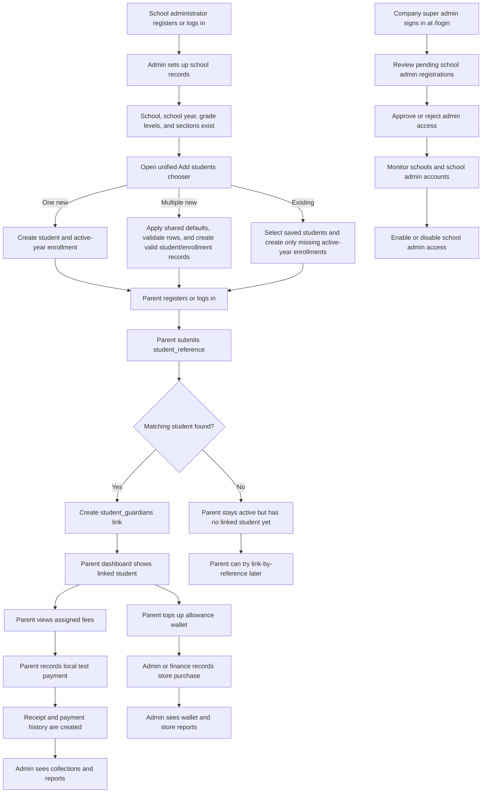
```mermaid
flowchart TD
  A["School administrator registers or logs in"] --> B["Admin sets up school records"]
  B --> C["School, school year, grade levels, and sections exist"]
  C --> D["Open unified Add students chooser"]
  D -->|One new| E["Create student and active-year enrollment"]
  D -->|Multiple new| F["Apply shared defaults, validate rows, and create valid student/enrollment records"]
  D -->|Existing| F1["Select saved students and create only missing active-year enrollments"]
  E --> G["Student gets official student_reference"]
  F --> G
  F1 --> G

  G["Parent registers or logs in"] --> H["Parent submits student_reference"]
  H --> I{"Matching student found?"}
  I -->|Yes| J["Create student_guardians link"]
  I -->|No| K["Parent stays active but has no linked student yet"]
  J --> L["Parent dashboard shows linked student"]
  K --> M["Parent can try link-by-reference later"]

  L --> N["Parent views assigned fees"]
  N --> O["Parent records local test payment"]
  O --> P["Receipt and payment history are created"]
  L --> Q["Parent tops up allowance wallet"]
  Q --> R["Admin or finance records store purchase"]

  P --> S["Admin sees collections and reports"]
  R --> T["Admin sees wallet and store reports"]
  U["Company super admin signs in at /login"] --> V["Review pending school admin registrations"]
  V --> W["Approve or reject admin access"]
  W --> X["Monitor schools and school admin accounts"]
  X --> Y["Enable or disable school admin access"]
```

## Company Super Admin Flow

### 0. Company Monitoring

Implemented.

The company super admin is an XMETA Pay account, not a school staff account. It signs in at `/login`, then uses the sidebar-based company workspace to monitor schools and a daily, weekly, monthly, or custom-date school-admin registration trend from `/super-admin/dashboard`, manage approved school admin accounts from `/super-admin/admin-accounts`, and review pending school admin registrations from `/super-admin/registrations`.

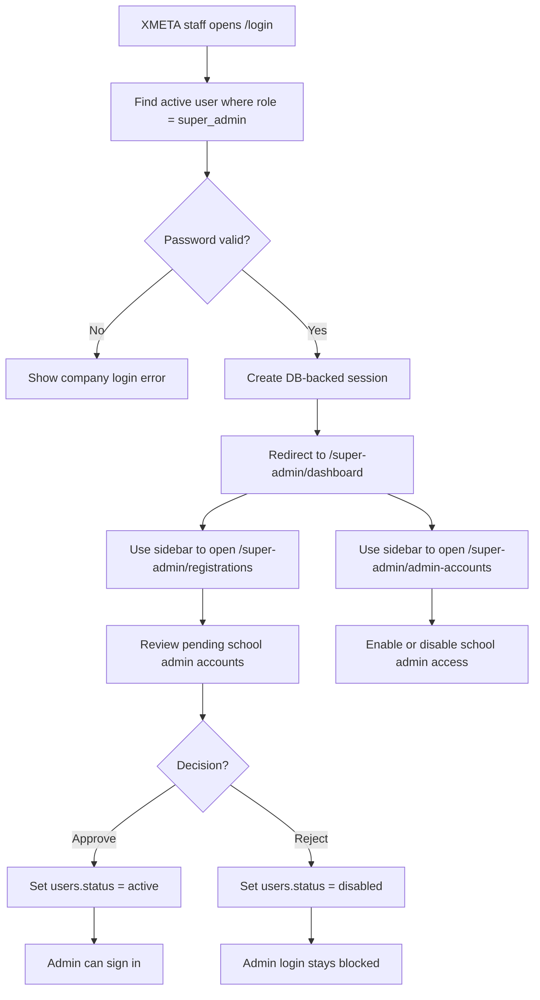
```mermaid
flowchart TD
  A["XMETA staff opens /login"] --> B["Find active user where role = super_admin"]
  B --> C{"Password valid?"}
  C -->|No| D["Show company login error"]
  C -->|Yes| E["Create DB-backed session"]
  E --> F["Redirect to /super-admin/dashboard"]
  F --> G["Use sidebar to open /super-admin/registrations"]
  G --> H["Review pending school admin accounts"]
  H --> I{"Decision?"}
  I -->|Approve| J["Set users.status = active"]
  I -->|Reject| K["Set users.status = disabled"]
  J --> L["Admin can sign in"]
  K --> M["Admin login stays blocked"]
  F --> N["Use sidebar to open /super-admin/admin-accounts"]
  N --> O["Enable or disable school admin access"]
```

MVP limits:

- No impersonation.
- No editing school setup, students, fees, payments, wallets, or reports.
- No committed seed credentials; the temporary SQL seed file is local-only and should be deleted after import.

## Admin Portal Flow

### 0. Admin Staff Role Access

Implemented.

All school staff accounts use `users.role = admin`, but `admin_profiles.staff_role` controls dashboard permissions.

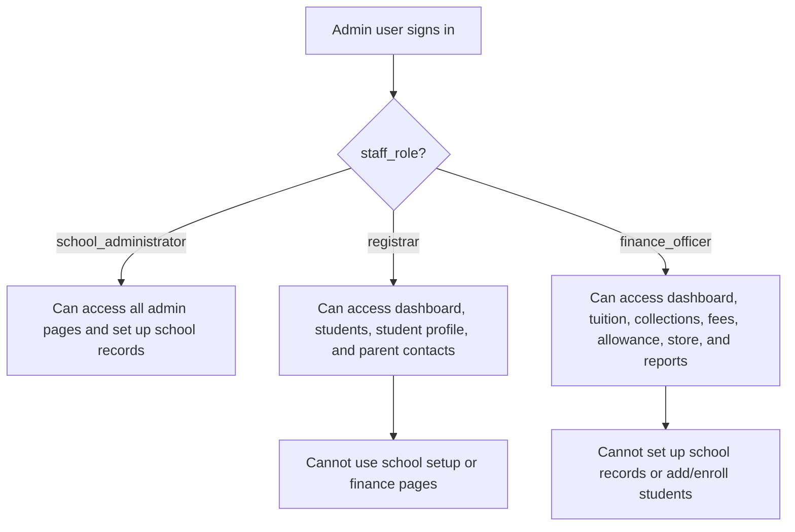
```mermaid
flowchart TD
  A["Admin user signs in"] --> B{"staff_role?"}
  B -->|school_administrator| C["Can access all admin pages and set up school records"]
  B -->|registrar| D["Can access dashboard, students, student profile, and parent contacts"]
  B -->|finance_officer| E["Can access dashboard, tuition, collections, fees, allowance, store, and reports"]
  D --> F["Cannot use school setup or finance pages"]
  E --> G["Cannot set up school records or add/enroll students"]
```

Permission source:

- `admin_profiles.staff_role`
- `ADMIN_ROLES.md`

### 1. Admin Registration And Login

Implemented.

The admin account starts in the shared `users` table with `role = admin`. Admin-specific school information is stored in `admin_profiles`.

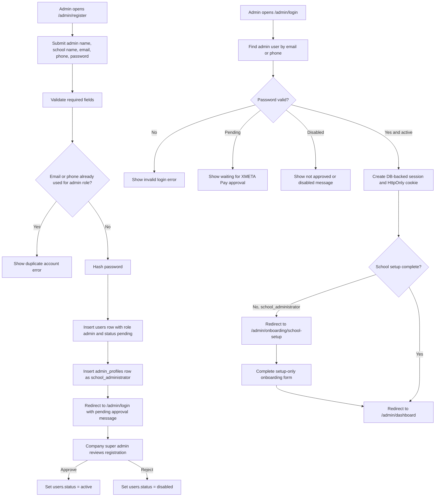
```mermaid
flowchart TD
  A["Admin opens /admin/register"] --> B["Submit admin name, school name, email, phone, password"]
  B --> C["Validate required fields"]
  C --> D{"Email or phone already used for admin role?"}
  D -->|Yes| E["Show duplicate account error"]
  D -->|No| F["Hash password"]
  F --> G["Insert users row with role admin and status pending"]
  G --> H["Insert admin_profiles row as school_administrator"]
  H --> I["Redirect to /admin/login with pending approval message"]
  I --> J["Company super admin reviews registration"]
  J -->|Approve| K["Set users.status = active"]
  J -->|Reject| L["Set users.status = disabled"]

  M["Admin opens /admin/login"] --> N["Find admin user by email or phone"]
  N --> O{"Password valid?"}
  O -->|No| P["Show invalid login error"]
  O -->|Pending| P2["Show waiting for XMETA Pay approval"]
  O -->|Disabled| P3["Show not approved or disabled message"]
  O -->|Yes and active| Q["Create DB-backed session and HttpOnly cookie"]
  Q --> R{"School setup complete?"}
  R -->|No, school_administrator| S["Redirect to /admin/onboarding/school-setup"]
  S --> T["Complete setup-only onboarding form"]
  T --> U["Redirect to /admin/dashboard"]
  R -->|Yes| U
```

Database touchpoints:

- `users`
- `admin_profiles`

### 2. Manual School Setup

Implemented.

After the admin logs in, the staff profile should be linked to a real school record. First-time onboarding remains one guided form: confirm the school, add one or more school years, choose exactly one active year, then add initial grades and sections. Ongoing management uses a concise hub at `/admin/school-setup`; focused modals update school/year metadata, `/admin/school-setup/years/[yearId]` manages one year's structure, and `/admin/school-setup/rollover` handles reviewed promotion. Activation remains a separate confirmation on the hub. Registrar and finance officer accounts share the same school context through `admin_profiles.school_id`.

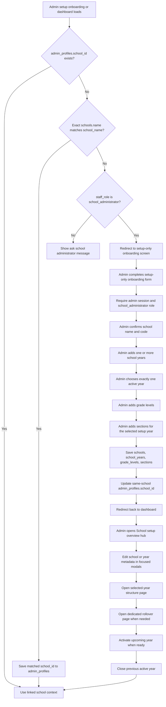
```mermaid
flowchart TD
  A["Admin setup onboarding or dashboard loads"] --> B{"admin_profiles.school_id exists?"}
  B -->|Yes| C["Use linked school context"]
  B -->|No| D{"Exact schools.name matches school_name?"}
  D -->|Yes| E["Save matched school_id to admin_profiles"]
  E --> C
  D -->|No| F{"staff_role is school_administrator?"}
  F -->|No| G["Show ask school administrator message"]
  F -->|Yes| H["Redirect to setup-only onboarding screen"]
  H --> I["Admin completes setup-only onboarding form"]
  I --> J["Require admin session and school_administrator role"]
  J --> K["Admin confirms school name and code"]
  K --> L["Admin adds one or more school years"]
  L --> M["Admin chooses exactly one active year"]
  M --> N["Admin adds grade levels"]
  N --> O["Admin adds sections for the selected setup year"]
  O --> P["Save schools, school_years, grade_levels, sections"]
  P --> Q["Update same-school admin_profiles.school_id"]
  Q --> R["Redirect back to dashboard"]
  R --> S["Admin opens School setup overview hub"]
  S --> T["Edit school or year metadata in focused modals"]
  T --> U["Open selected-year structure page"]
  U --> V["Open dedicated rollover page when needed"]
  V --> W["Activate upcoming year when ready"]
  W --> X["Close previous active year"]
  X --> C
```

Database touchpoints:

- `admin_profiles`
- `schools`
- `school_years`
- `grade_levels`
- `sections`

### 3. Admin School-Year View Context

Implemented.

The admin portal can view data for any configured school year. The selected year is stored in a safe cookie containing only a school year id. The backend validates that the selected year belongs to the signed-in admin's school before using it. Operational write actions still use the active year only, so upcoming and closed years are read-only view/report contexts for the MVP. New payment, wallet, store, and reminder history rows store `school_year_id` so selected-year reports do not depend only on enrollment inference.

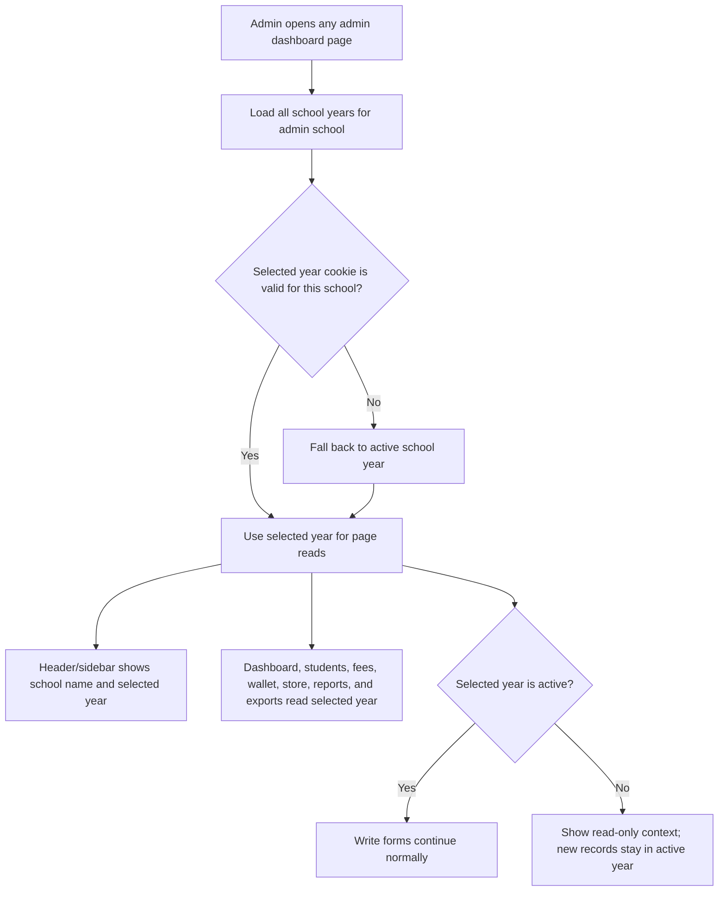
```mermaid
flowchart TD
  A["Admin opens any admin dashboard page"] --> B["Load all school years for admin school"]
  B --> C{"Selected year cookie is valid for this school?"}
  C -->|Yes| D["Use selected year for page reads"]
  C -->|No| E["Fall back to active school year"]
  E --> D
  D --> F["Header/sidebar shows school name and selected year"]
  D --> G["Dashboard, students, fees, wallet, store, reports, and exports read selected year"]
  D --> H{"Selected year is active?"}
  H -->|Yes| I["Write forms continue normally"]
  H -->|No| J["Show read-only context; new records stay in active year"]
```

Database touchpoints:

- `school_years`
- selected-year records in `enrollments`, `fee_types`, `student_fee_assignments`, `payments`, `wallet_transactions`, `store_transactions`, and `notification_logs`

### 3A. Manual School-Year Rollover

Implemented.

Student master records stay shared across years. Rollover lists only students enrolled in the source year, lets the school administrator explicitly select one or many students, suggests the next grade, preserves a matching section name when possible, and lets the administrator review promote, repeat, student type, or skip decisions. Saving creates only new `enrollments` rows for checked promote/repeat students, defaulting their type to `Returned`; it does not duplicate `students` or copy fees, payments, wallets, stores, or reminders.

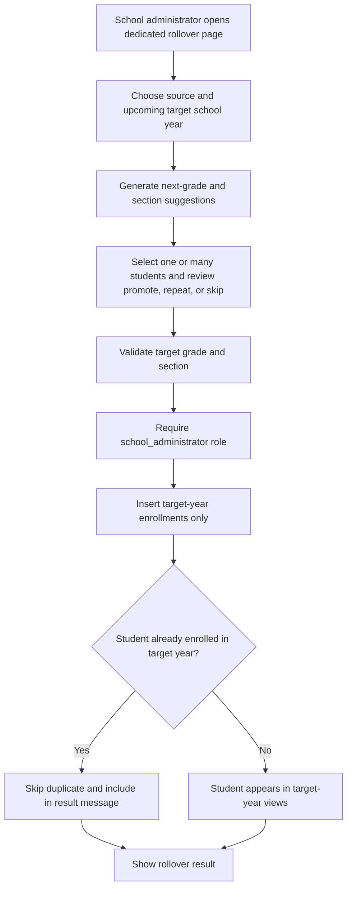
```mermaid
flowchart TD
  A["School administrator opens dedicated rollover page"] --> B["Choose source and upcoming target school year"]
  B --> C["Generate next-grade and section suggestions"]
  C --> D["Select one or many students and review promote, repeat, or skip"]
  D --> E["Validate target grade and section"]
  E --> F["Require school_administrator role"]
  F --> G["Insert target-year enrollments only"]
  G --> H{"Student already enrolled in target year?"}
  H -->|Yes| I["Skip duplicate and include in result message"]
  H -->|No| J["Student appears in target-year views"]
  I --> K["Show rollover result"]
  J --> K
```

Database touchpoints:

- `students`
- `enrollments`
- `school_years`
- `grade_levels`
- `sections`

### 3B. Activate Next School Year

Implemented.

Only a `school_administrator` can activate an upcoming school year. Activation is a protected server action that validates the target year belongs to the school, confirms the target year has sections, closes the previous active year, activates the target year, and sets the admin selected-year cookie to the new active year.

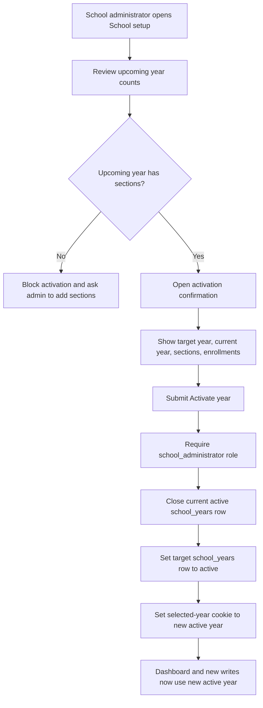
```mermaid
flowchart TD
  A["School administrator opens School setup"] --> B["Review upcoming year counts"]
  B --> C{"Upcoming year has sections?"}
  C -->|No| D["Block activation and ask admin to add sections"]
  C -->|Yes| E["Open activation confirmation"]
  E --> F["Show target year, current year, sections, enrollments"]
  F --> G["Submit Activate year"]
  G --> H["Require school_administrator role"]
  H --> I["Close current active school_years row"]
  I --> J["Set target school_years row to active"]
  J --> K["Set selected-year cookie to new active year"]
  K --> L["Dashboard and new writes now use new active year"]
```

Database touchpoints:

- `school_years`

### 4. Admin Student Creation And Enrollment

Implemented.

The school/admin side creates the official student record first. One `Add students` chooser opens focused workflows for one new student, multiple new students, or existing students. New-student batches can apply shared grade, section, and student-type defaults before individual overrides; duplicate references and incomplete rows are identified before submission, while server validation remains authoritative. Existing students with no active-year enrollment are selected without re-entering names, birthdates, references, or parent links. Valid rows remain independent and duplicate enrollments are skipped safely.

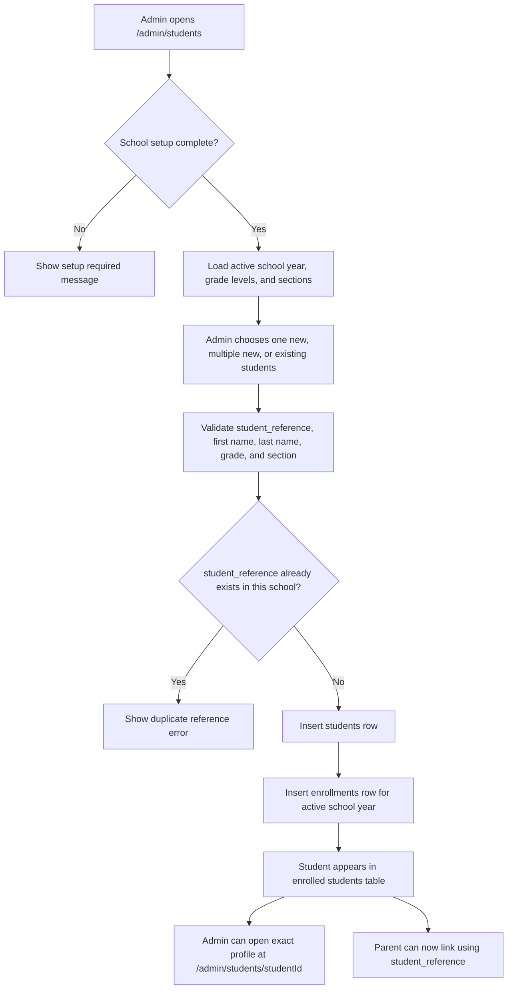
```mermaid
flowchart TD
  A["Admin opens /admin/students"] --> B{"School setup complete?"}
  B -->|No| C["Show setup required message"]
  B -->|Yes| D["Load active school year, grade levels, and sections"]
  D --> E["Admin chooses one new, multiple new, or existing students"]
  E --> F["Validate student_reference, first name, last name, grade, and section"]
  F --> G{"student_reference already exists in this school?"}
  G -->|Yes| H["Show duplicate reference error"]
  G -->|No| I["Insert students row"]
  I --> J["Insert enrollments row for active school year"]
  J --> K["Student appears in enrolled students table"]
  K --> L["Admin can open exact profile at /admin/students/studentId"]
  K --> M["Parent can now link using student_reference"]
```

Database touchpoints:

- `students`
- `enrollments`
- `school_years`
- `grade_levels`
- `sections`

### 4. Admin Parent Directory

Implemented foundation.

The admin can see parent accounts that have linked students and parent accounts that are still pending because their student reference has not matched an official student yet.

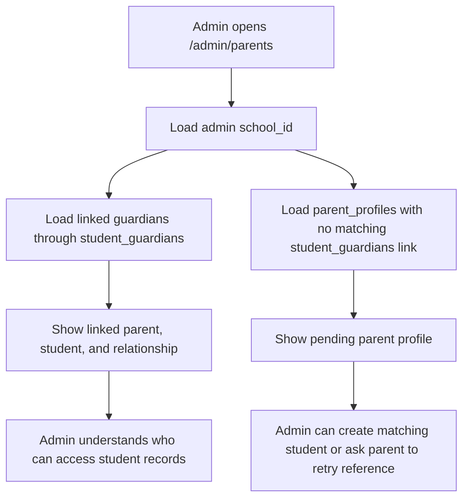
```mermaid
flowchart TD
  A["Admin opens /admin/parents"] --> B["Load admin school_id"]
  B --> C["Load linked guardians through student_guardians"]
  B --> D["Load parent_profiles with no matching student_guardians link"]
  C --> E["Show linked parent, student, and relationship"]
  D --> F["Show pending parent profile"]
  E --> G["Admin understands who can access student records"]
  F --> H["Admin can create matching student or ask parent to retry reference"]
```

Database touchpoints:

- `users`
- `parent_profiles`
- `student_guardians`
- `students`
- `enrollments`

## Parent Portal Flow

### 1. Parent Registration And Automatic Student Linking

Implemented.

During registration, the parent can submit one or more `student_reference` values. The first reference is saved in `parent_profiles` for pending-link display, and every submitted reference attempts a separate `student_guardians` link. Parents can still add more children later from the portal.

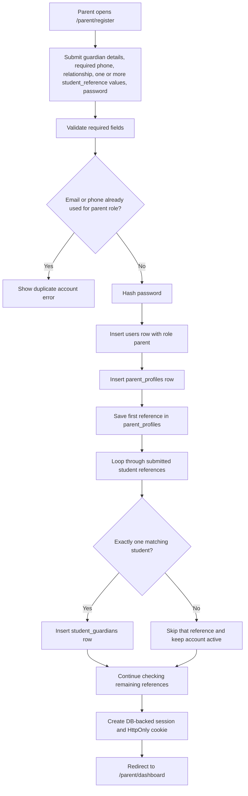
```mermaid
flowchart TD
  A["Parent opens /parent/register"] --> B["Submit guardian details, required phone, relationship, one or more student_reference values, password"]
  B --> C["Validate required fields"]
  C --> D{"Email or phone already used for parent role?"}
  D -->|Yes| E["Show duplicate account error"]
  D -->|No| F["Hash password"]
  F --> G["Insert users row with role parent"]
  G --> H["Insert parent_profiles row"]
  H --> I["Save first reference in parent_profiles"]
  I --> J["Loop through submitted student references"]
  J --> K{"Exactly one matching student?"}
  K -->|Yes| L["Insert student_guardians row"]
  K -->|No| M["Skip that reference and keep account active"]
  L --> N["Continue checking remaining references"]
  M --> N
  N --> O["Create DB-backed session and HttpOnly cookie"]
  O --> P["Redirect to /parent/dashboard"]
```

Database touchpoints:

- `users`
- `parent_profiles`
- `students`
- `student_guardians`

### 2. Parent Login And Dashboard Student Read

Implemented.

The parent dashboard must only show students linked to the signed-in parent through `student_guardians`.

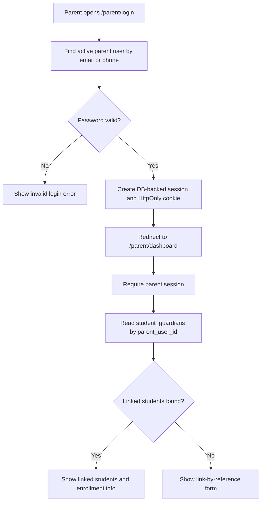
```mermaid
flowchart TD
  A["Parent opens /parent/login"] --> B["Find active parent user by email or phone"]
  B --> C{"Password valid?"}
  C -->|No| D["Show invalid login error"]
  C -->|Yes| E["Create DB-backed session and HttpOnly cookie"]
  E --> F["Redirect to /parent/dashboard"]
  F --> G["Require parent session"]
  G --> H["Read student_guardians by parent_user_id"]
  H --> I{"Linked students found?"}
  I -->|Yes| J["Show linked students and enrollment info"]
  I -->|No| K["Show link-by-reference form"]
```

Database touchpoints:

- `users`
- `student_guardians`
- `students`
- `enrollments`
- `grade_levels`
- `sections`

### 3. Parent Add Another Student By Reference

Implemented.

If parent registration did not find a student yet, or if the parent has another child at the school, the parent can add another `student_reference` from the dashboard or `/parent/students`.

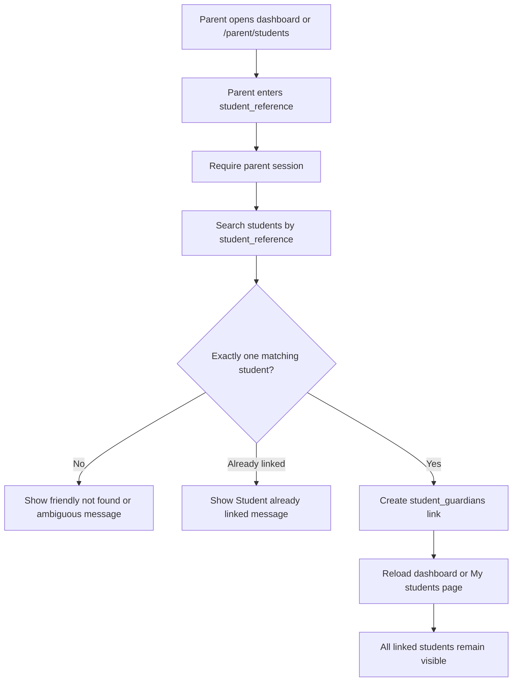
```mermaid
flowchart TD
  A["Parent opens dashboard or /parent/students"] --> B["Parent enters student_reference"]
  B --> C["Require parent session"]
  C --> D["Search students by student_reference"]
  D --> E{"Exactly one matching student?"}
  E -->|No| F["Show friendly not found or ambiguous message"]
  E -->|Already linked| G["Show Student already linked message"]
  E -->|Yes| H["Create student_guardians link"]
  H --> I["Reload dashboard or My students page"]
  I --> J["All linked students remain visible"]
```

Database touchpoints:

- `students`
- `student_guardians`
- `parent_profiles`

## Cross-Portal Interaction Rule

Implemented.

The parent does not own a student just because they typed a student reference once. The real access rule is the database link in `student_guardians`, and one parent can have many linked students through separate rows.

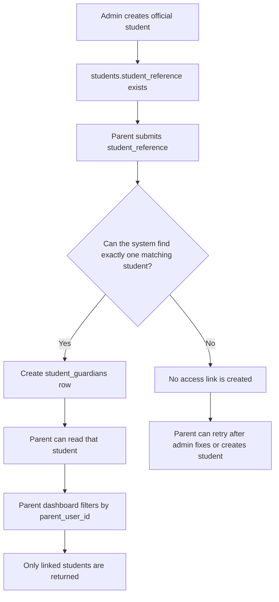
```mermaid
flowchart TD
  A["Admin creates official student"] --> B["students.student_reference exists"]
  B --> C["Parent submits student_reference"]
  C --> D{"Can the system find exactly one matching student?"}
  D -->|No| E["No access link is created"]
  D -->|Yes| F["Create student_guardians row"]
  F --> G["Parent can read that student"]
  G --> H["Parent dashboard filters by parent_user_id"]
  H --> I["Only linked students are returned"]
  E --> J["Parent can retry after admin fixes or creates student"]
```

Access rule:

```text
Parent can view student data only when:
student_guardians.parent_user_id = signed_in_parent_user_id
and student_guardians.student_id = students.id
```

## Password Recovery Flow

Implemented.

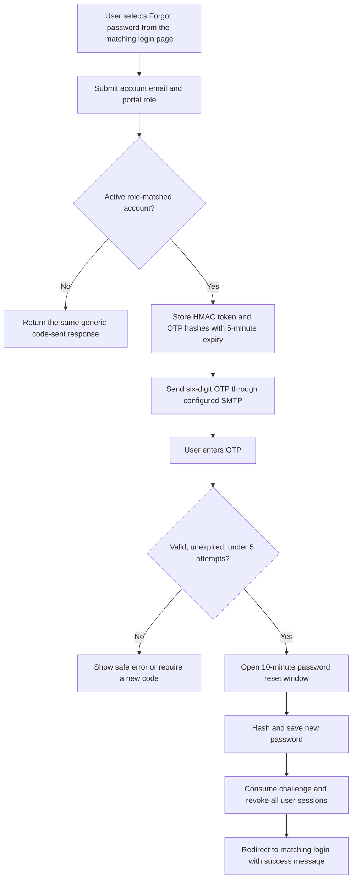
```mermaid
flowchart TD
  A["User selects Forgot password from the matching login page"] --> B["Submit account email and portal role"]
  B --> C{"Active role-matched account?"}
  C -->|No| D["Return the same generic code-sent response"]
  C -->|Yes| E["Store HMAC token and OTP hashes with 5-minute expiry"]
  E --> F["Send six-digit OTP through configured SMTP"]
  F --> G["User enters OTP"]
  G --> H{"Valid, unexpired, under 5 attempts?"}
  H -->|No| I["Show safe error or require a new code"]
  H -->|Yes| J["Open 10-minute password reset window"]
  J --> K["Hash and save new password"]
  K --> L["Consume challenge and revoke all user sessions"]
  L --> M["Redirect to matching login with success message"]
```

Resend is server-enforced after 60 seconds and limited to five sends per account per rolling hour. Unknown, pending, and disabled accounts receive the same request response but no email. Password recovery never changes approval or disabled status.

Database touchpoints:

- `users`
- `password_reset_challenges`
- `auth_sessions`
- `xmetapay_password_reset` HttpOnly cookie containing only the raw random challenge token

## Session Guard And Logout Flow

Implemented.

All portals use the same `xmetapay_session` cookie, but the cookie only stores a random session token. The server stores the hashed token in `auth_sessions`, and role checks decide which dashboard is allowed.

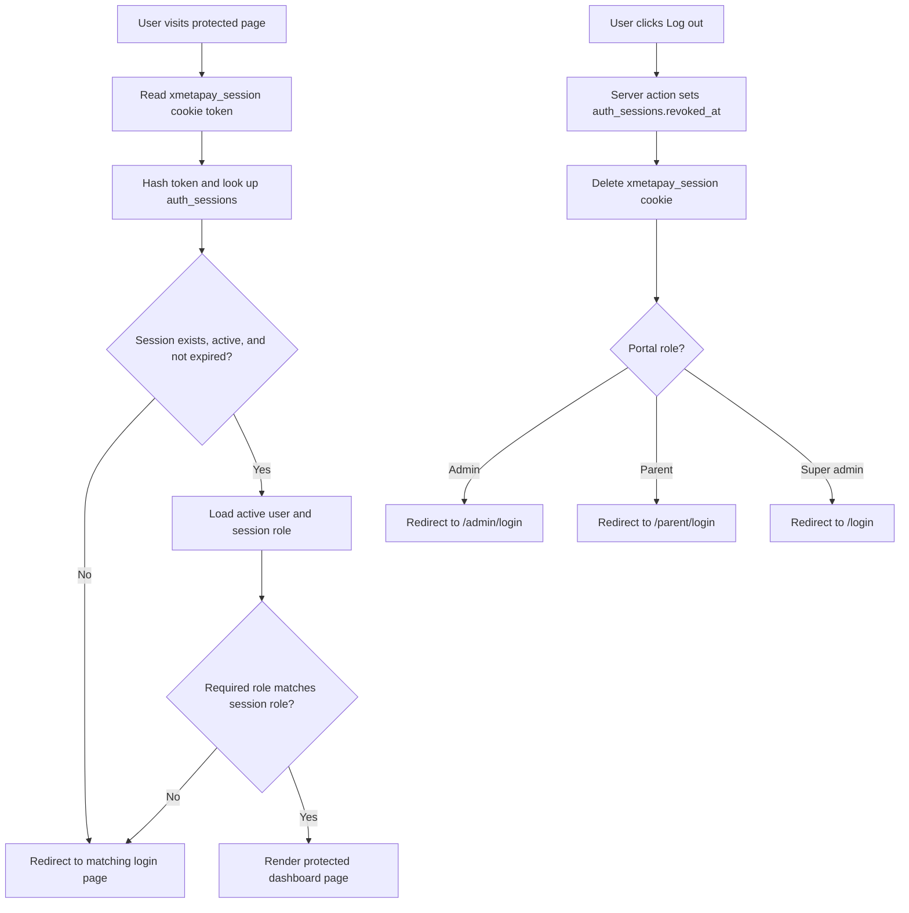
```mermaid
flowchart TD
  A["User visits protected page"] --> B["Read xmetapay_session cookie token"]
  B --> C["Hash token and look up auth_sessions"]
  C --> D{"Session exists, active, and not expired?"}
  D -->|No| E["Redirect to matching login page"]
  D -->|Yes| F["Load active user and session role"]
  F --> G{"Required role matches session role?"}
  G -->|No| E
  G -->|Yes| H["Render protected dashboard page"]

  I["User clicks Log out"] --> J["Server action sets auth_sessions.revoked_at"]
  J --> K["Delete xmetapay_session cookie"]
  K --> L{"Portal role?"}
  L -->|Admin| M["Redirect to /admin/login"]
  L -->|Parent| N["Redirect to /parent/login"]
  L -->|Super admin| O["Redirect to /login"]
```

Database touchpoints:

- `users`
- `auth_sessions`
- `xmetapay_session` HttpOnly cookie containing only the raw random token

## Fees And Tuition Flow

Implemented.

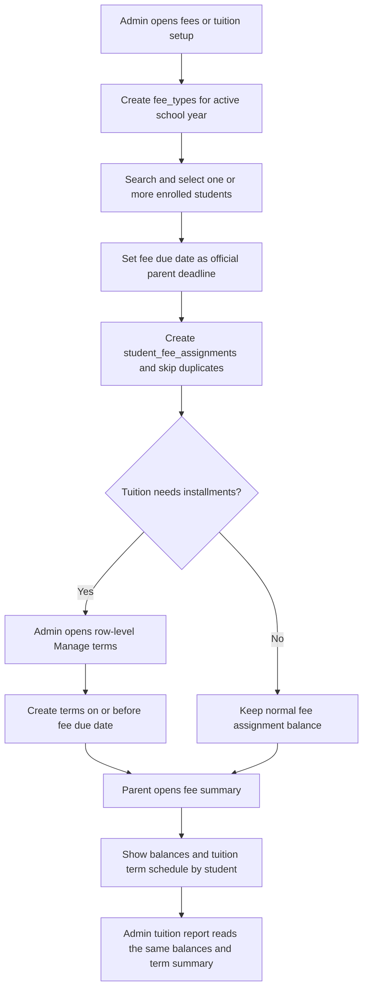
```mermaid
flowchart TD
  A["Admin opens fees or tuition setup"] --> B["Create fee_types for active school year"]
  B --> C["Search and select one or more enrolled students"]
  C --> D["Set fee due date as official parent deadline"]
  D --> E["Create student_fee_assignments and skip duplicates"]
  E --> F{"Tuition needs installments?"}
  F -->|Yes| G["Admin opens row-level Manage terms"]
  G --> H["Create terms on or before fee due date"]
  F -->|No| I["Keep normal fee assignment balance"]
  H --> J["Parent opens fee summary"]
  I --> J
  J --> K["Show balances and tuition term schedule by student"]
  K --> L["Admin tuition report reads the same balances and term summary"]
```

Database touchpoints:

- `fee_types`
- `student_fee_assignments`
- `tuition_payment_terms`
- `students`
- `student_guardians`
- `school_years`

## Payment And Receipt Flow

Implemented for local MVP testing. Payments are recorded as paid immediately without a real payment gateway. Real gateway integration, refunds, and admin manual payment recording can come later.

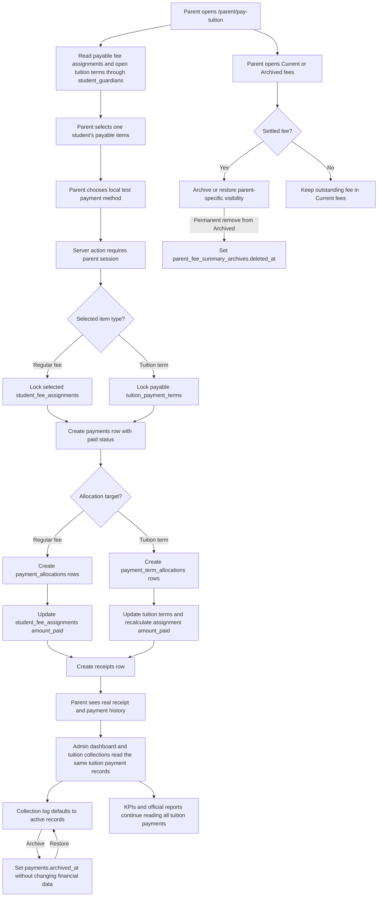
```mermaid
flowchart TD
  A["Parent opens /parent/pay-tuition"] --> B["Read payable fee assignments and open tuition terms through student_guardians"]
  B --> C["Parent selects one student's payable items"]
  C --> D["Parent chooses local test payment method"]
  D --> E["Server action requires parent session"]
  E --> F{"Selected item type?"}
  F -->|Regular fee| G["Lock selected student_fee_assignments"]
  F -->|Tuition term| H["Lock payable tuition_payment_terms"]
  G --> I["Create payments row with paid status"]
  H --> I
  I --> J{"Allocation target?"}
  J -->|Regular fee| K["Create payment_allocations rows"]
  J -->|Tuition term| L["Create payment_term_allocations rows"]
  K --> M["Update student_fee_assignments amount_paid"]
  L --> N["Update tuition terms and recalculate assignment amount_paid"]
  M --> O["Create receipts row"]
  N --> O
  O --> P["Parent sees real receipt and payment history"]
  P --> Q["Admin dashboard and tuition collections read the same tuition payment records"]
  Q --> R["Collection log defaults to active records"]
  R -->|Archive| S["Set payments.archived_at without changing financial data"]
  S -->|Restore| R
  Q --> T["KPIs and official reports continue reading all tuition payments"]
  A --> U["Parent opens Current or Archived fees"]
  U --> V{"Settled fee?"}
  V -->|Yes| W["Archive or restore parent-specific visibility"]
  W -->|Permanent remove from Archived| Y["Set parent_fee_summary_archives.deleted_at"]
  V -->|No| X["Keep outstanding fee in Current fees"]
```

- The Tuition collection log supports reversible row and bulk archive/restore. Archive changes only `payments.archived_at`; official totals, reports, receipts, balances, allocations, and parent history continue reading the complete payment record.

Database touchpoints:

- `payments`
- `payment_allocations`
- `payment_term_allocations`
- `receipts`
- `student_fee_assignments`
- `tuition_payment_terms`
- `student_guardians`

Tuition terms are implemented per student tuition assignment through a shared server-only tuition terms helper. Parents can pay open or partial terms early, even before the due date. Other fees remain on the normal fee assignment payment flow.

Due date rule:

- Fees use the assignment due date from `student_fee_assignments` as the official parent-facing deadline.
- Tuition term schedule dates must be on or before the official assignment due date.
- Parent-facing payment rows and term rows show the main assignment due date as the deadline.
- The parent Fee summary PDF export includes nested tuition term rows under each tuition fee.
- The parent Fee summary has local Current/Archived views. Only paid or zero-balance assignments can be archived. Archived rows can be restored or permanently removed for that parent by setting `parent_fee_summary_archives.deleted_at`.
- Permanent removal has row and bulk confirmation, cannot be undone in the parent portal, and excludes the row from that parent's lists and exports.
- Fee metrics, payable counts, payments, tuition terms, admin reports, and another linked guardian's view continue using the authoritative records.
- Parent Payment history has separate local Current/Archived views backed by `parent_payment_history_archives`. Finished payments can be archived or restored, and archived rows can be permanently removed for that parent by setting `deleted_at`.
- Permanent removal has row and bulk confirmation, cannot be undone in the parent portal, and excludes the row from that parent's Payment history and exports. Pending payments, receipts, allocations, wallet top-ups, balances, dashboard activity, admin collections, reports, and audit records remain unchanged.

## Wallet, Allowance, And Store Flow

Wallet top-up is implemented for local MVP testing. Store/canteen purchase recording is implemented for local MVP testing. In the admin Store transactions page, `Create merchant` and `Record purchase` are focused action modals above the real transaction log.

Wallets should be separate from tuition payments so allowance and store/canteen spending can be tracked clearly.

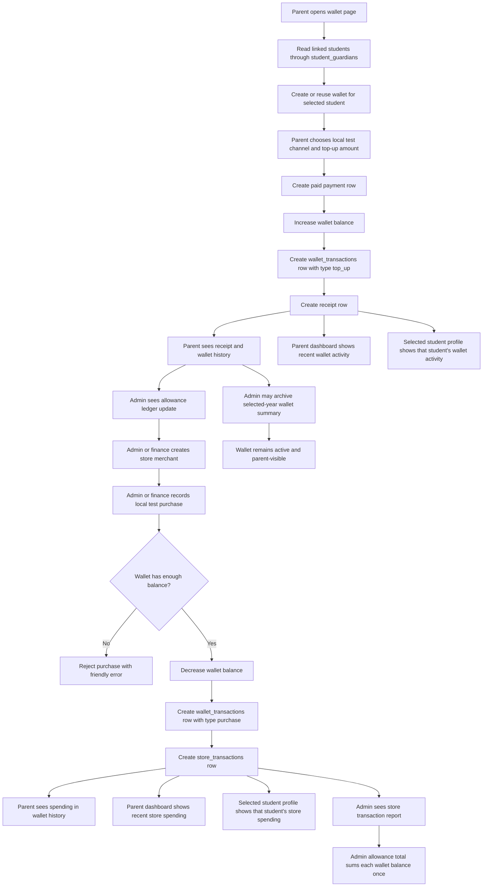
```mermaid
flowchart TD
  A["Parent opens wallet page"] --> B["Read linked students through student_guardians"]
  B --> C["Create or reuse wallet for selected student"]
  C --> D["Parent chooses local test channel and top-up amount"]
  D --> E["Create paid payment row"]
  E --> F["Increase wallet balance"]
  F --> G["Create wallet_transactions row with type top_up"]
  G --> H["Create receipt row"]
  H --> I["Parent sees receipt and wallet history"]
  H --> I2["Parent dashboard shows recent wallet activity"]
  H --> I3["Selected student profile shows that student's wallet activity"]
  I --> J["Admin sees allowance ledger update"]
  J --> K["Admin or finance creates store merchant"]
  K --> L["Admin or finance records local test purchase"]
  L --> M{"Wallet has enough balance?"}
  M -->|No| N["Reject purchase with friendly error"]
  M -->|Yes| O["Decrease wallet balance"]
  O --> P["Create wallet_transactions row with type purchase"]
  P --> Q["Create store_transactions row"]
  Q --> R["Parent sees spending in wallet history"]
  Q --> R2["Parent dashboard shows recent store spending"]
  I --> U["Admin may archive selected-year wallet summary"]
  U --> V["Wallet remains active and parent-visible"]
  Q --> R3["Selected student profile shows that student's store spending"]
  Q --> S["Admin sees store transaction report"]
  S --> T["Admin allowance total sums each wallet balance once"]
```

Database touchpoints:

- `wallets`
- `wallet_transactions`
- `wallet_ledger_archives`
- `store_merchants`
- `store_transactions`
- `payments`

Data accuracy rule:

- Admin allowance `Total balance` should sum the current `wallets.balance` once per wallet.
- Admin allowance `Top-ups this month` should sum current-month wallet top-up ledger rows.
- Allowance archive/restore changes only year-scoped `wallet_ledger_archives` metadata. Current wallet balances and operational history remain unchanged and included in KPIs and reports.
- Wallet transaction rows are used for top-up history, store purchase history, monthly spend, parent dashboard wallet activity, selected student profile wallet activity, and store reports.
- Parent payment history stays payment-only; store purchases appear in wallet history, the dashboard wallet activity snapshot, and the selected student profile wallet activity snapshot.
- Do not calculate total wallet balance by summing joined wallet/transaction rows, because a wallet with multiple transactions would be counted more than once.

Role rule:

- `school_administrator` and `finance_officer` can record store purchases.
- `registrar` cannot record store purchases because store spending is a finance operation.

## Report CSV And PDF Export Flow

Implemented for admin/school reporting. CSV and PDF exports are generated from current operational MySQL records instead of storing separate report rows.

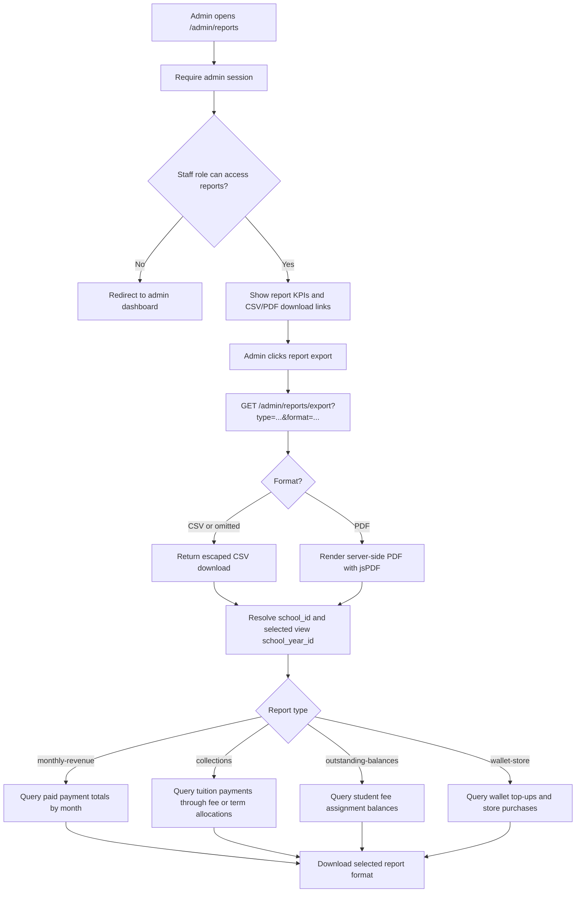
```mermaid
flowchart TD
  A["Admin opens /admin/reports"] --> B["Require admin session"]
  B --> C{"Staff role can access reports?"}
  C -->|No| D["Redirect to admin dashboard"]
  C -->|Yes| E["Show report KPIs and CSV/PDF download links"]
  E --> F["Admin clicks report export"]
  F --> G["GET /admin/reports/export?type=...&format=..."]
  G --> H{"Format?"}
  H -->|CSV or omitted| I["Return escaped CSV download"]
  H -->|PDF| J["Render server-side PDF with jsPDF"]
  I --> K["Resolve school_id and selected view school_year_id"]
  J --> K
  K --> L{"Report type"}
  L -->|monthly-revenue| M["Query paid payment totals by month"]
  L -->|collections| N["Query tuition payments through fee or term allocations"]
  L -->|outstanding-balances| O["Query student fee assignment balances"]
  L -->|wallet-store| P["Query wallet top-ups and store purchases"]
  M --> Q["Download selected report format"]
  N --> Q
  O --> Q
  P --> Q
```

Current CSV/PDF reports:

- Monthly revenue
- Tuition collections
- Outstanding balances
- Wallet and store activity

Future reporting:

- Scheduled report delivery
- Notification-based report alerts

## Payment Reminder Email Flow

Implemented for MVP email delivery. The tuition page opens an email-only reminder modal with target, reminder type, optional specific-student reference, and optional message fields. The protected action verifies SMTP, queues audit rows, sends real emails to linked parent addresses through Nodemailer, and records each delivery result. SMS remains future work.

```mermaid
flowchart TD
  A["School administrator or finance officer opens tuition report"] --> B["Require admin session"]
  B --> C{"Can access finance?"}
  C -->|No| D["Redirect to admin dashboard"]
  C -->|Yes| E["Open Send email reminders modal"]
  E --> E2["Choose target, type, and optional message"]
  E2 --> F["Verify SMTP configuration"]
  F --> G["Find linked parents with matching open or partial fee balances and real email addresses"]
  G --> G2["Exclude sent emails and recent queued attempts already recorded today"]
  G2 --> H{"Any new reminder targets?"}
  H -->|No open balances| I["Show no reminders logged"]
  H -->|Already reminded today| J["Show reminders already logged today"]
  H -->|Yes| H2["Bulk-load matching fee assignments and tuition terms"]
  H2 --> K["Build itemized HTML/text and insert queued reminder rows"]
  K --> L["Commit rows, then send through pooled Nodemailer SMTP"]
  L --> M{"Delivery result"}
  M -->|Sent| N["Set status sent and sent_at"]
  M -->|Failed| O["Set status failed and allow retry"]
  N --> P["Tuition history and dashboard activity update"]
  O --> P
  P --> Q{"Organize reminder history?"}
  Q -->|Archive| R["Set archived_at and show in Archived reminders"]
  R -->|Restore| P
```

Current reminder rules:

- Only `school_administrator` and `finance_officer` can send payment reminder emails.
- `registrar` cannot send reminders because reminders are tied to finance balances.
- Reminder candidates must have a linked parent through `student_guardians`.
- The server bulk-loads matching active-year fee assignments and optional tuition terms for up to 100 targets.
- HTML and plain-text emails show the student reference, itemized billed/paid/balance amounts, official assignment due dates, and term schedule details.
- Custom reminder text is introductory and never replaces the itemized financial statement.
- New reminder rows use `type = payment_reminder` and `channel = email`; older email/SMS history remains visible.
- A sent row or recently queued attempt prevents another same-day email for the same school year, school, linked parent, and student. Failed attempts may be retried.
- Successful delivery sets `status = sent` and `sent_at`; unsuccessful delivery sets `status = failed`.
- The custom message field is stored in `notification_logs.message_body`; if it is blank, the server stores a generated default reminder message.
- School administrators and finance officers can archive or restore one or many payment-reminder rows. Archive changes only `archived_at`; it does not delete the row or change delivery status, recipient, message, or sent time.
- Active and archived reminder views use the selected admin school-year context. Archived sent reminders continue to participate in same-day duplicate protection.
- Registrars cannot send, archive, or restore payment reminders, and no permanent-delete action is available.
- SMTP credentials stay in local/deployment environment variables. SMS, scheduling, webhooks, and bounce handling remain future work.

SMTP configuration uses `SMTP_HOST`, `SMTP_PORT`, `SMTP_SECURE`, `SMTP_USER`, `SMTP_PASSWORD`, `SMTP_FROM_EMAIL`, `SMTP_FROM_NAME`, and `APP_BASE_URL`. Gmail/Workspace uses a Google App Password rather than the account's normal password. Real values must stay in the local `.env` file or deployment environment-variable panel and must not be committed.

## Real-Data Table Export Flow

Implemented for admin and parent screens that already use database-backed tables. Tables paginate on screen, while CSV/PDF exports use the filtered rows after search and filters are applied.

```mermaid
flowchart TD
  A["User opens a real-data table"] --> B["Page loads MySQL-backed rows"]
  B --> C["User searches or filters the table"]
  C --> D["Visible rows update in the browser"]
  D --> E["User pages through filtered rows"]
  E --> F{"Export format?"}
  F -->|CSV| G["Download filtered rows as CSV"]
  F -->|PDF| H["Download filtered rows as PDF"]
```

Current table export screens include admin dashboard recent activity, tuition, collections, other fees, allowance, store transactions, enrolled students, parent contacts, parent fee summary, parent payment history, parent dashboard recent payments, and parent wallet activity.

## Practical Testing Flow

Use this testing order when checking the project manually in XAMPP:

1. Register an admin account.
2. Log in as admin.
3. Set up school records with one or more school years, one active year, grade levels, and active-year sections.
4. Create a student with a clear `student_reference`.
5. Confirm the student appears in the admin student table.
6. Register a parent account using the same `student_reference`.
7. Confirm the parent dashboard shows the linked student.
8. Log out as parent.
9. Log back in as parent and confirm the linked student is still there.
10. Log out as admin.
11. Log back in as admin and confirm the student and parent link are still visible.

## Safe Data Notes

- Do not commit `.env`.
- Do not commit real database exports.
- Do not commit real parent, student, school, payment, or credential data.
- Keep passwords stored only as `password_hash` in the database.
- Keep this document as a planning and explanation guide, not a seed-data file.
