# XMETA Pay Project Flowcharts

This document explains the whole XMETA Pay project flow from the user side and the database side. It focuses on how the admin/school portal and parent portal interact, starting from registration and continuing through student enrollment, guardian linking, and future payment, wallet, store, and report phases.

Related documents:

- `DATABASE_SCHEMA_PLAN.md` - full database schema plan and ERD.
- `DATABASE_SCHEMA_EXPLANATION.md` - plain-language schema explanation.
- `DATABASE_SCHEMA_VISUAL_PLAN.html` - browser visual for the database schema.
- `CHECKLIST.md` - backend implementation tracker.
- `ADMIN_ROLES.md` - admin/school staff roles and dashboard permissions.
- `PROJECT_FLOWCHARTS_VISUAL.html` - browser visual for this project flow document.

## Status Legend

| Label | Meaning |
| --- | --- |
| Implemented | Already built in the current project flow. |
| Next | Best near-term backend work after the current phase. |
| Future | Planned later after the current backend foundation is stable. |

## Current Working Flow

Implemented:

- Admin/school registration and login.
- Parent registration and login.
- Logout and protected dashboard redirects.
- Local MySQL/XAMPP database connection through environment variables.
- Full schema import through `database/full-schema-v1.sql`.
- Manual school setup by `school_administrator`.
- Admin/school staff role permissions for `school_administrator`, `registrar`, and `finance_officer`.
- Admin student creation and enrollment.
- Admin student profile selector and exact profile route `/admin/students/[studentId]`.
- Parent-to-student linking through `student_reference`.
- Parent dashboard reads linked students through `student_guardians`.
- Parent-side mock enrollment wizard has been removed; the parent portal links existing school-created students only.

Next:

- Fees and tuition backend.
- Parent fee summary from MySQL.
- Admin tuition report from MySQL.

Future:

- Payments, allocations, and receipts.
- Wallet, allowance, and store/canteen transactions.
- Notifications and report exports.

## Whole Project Overview

The important idea is simple: the admin/school side creates and manages the official school records, while the parent side can only see students linked to that parent account.

For the current backend phase, parents do not directly enroll new students from the parent portal. They link to students that the school/admin side already created and enrolled.

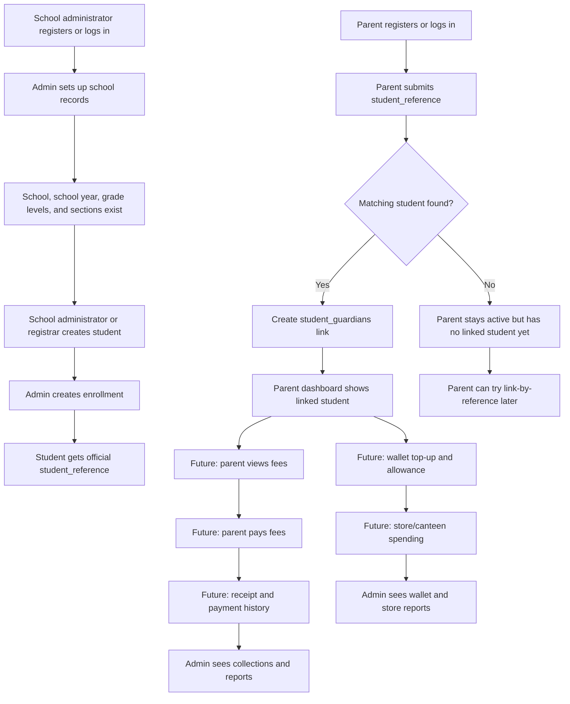

## Admin Portal Flow

### 0. Admin Staff Role Access

Implemented.

All school staff accounts use `users.role = admin`, but `admin_profiles.staff_role` controls dashboard permissions.

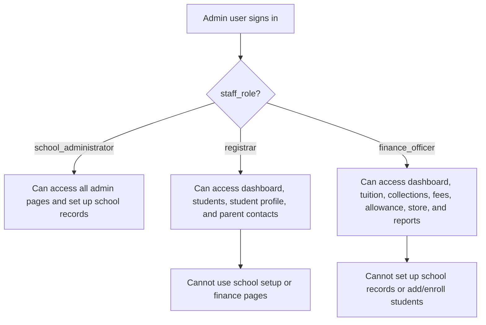

Permission source:

- `admin_profiles.staff_role`
- `ADMIN_ROLES.md`

### 1. Admin Registration And Login

Implemented.

The admin account starts in the shared `users` table with `role = admin`. Admin-specific school information is stored in `admin_profiles`.

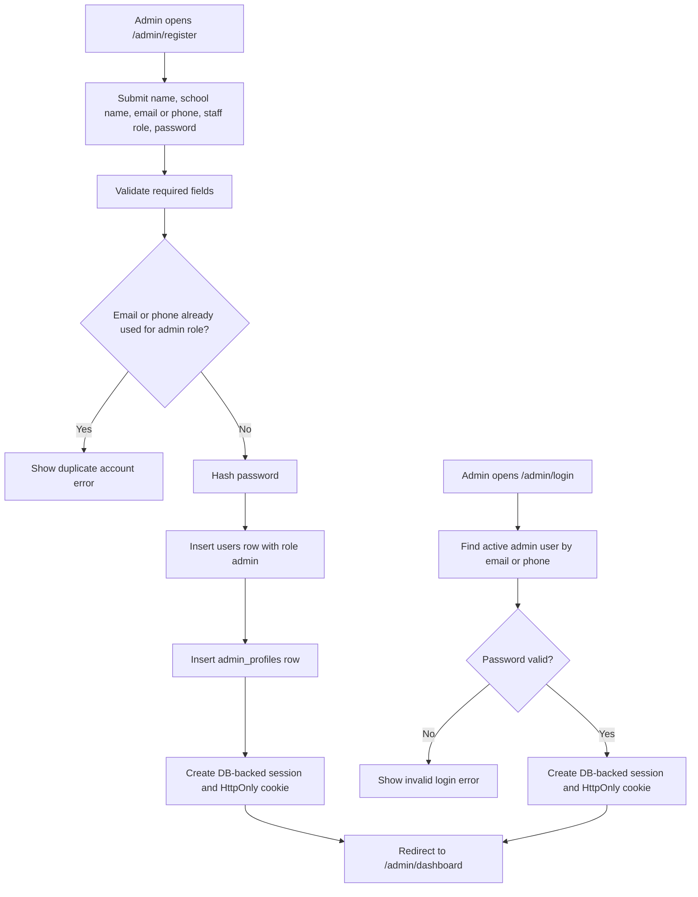

Database touchpoints:

- `users`
- `admin_profiles`

### 2. Manual School Setup

Implemented.

After the admin logs in, the staff profile should be linked to a real school record. A school administrator manually confirms the school, active school year, grade levels, and sections. Registrar and finance officer accounts then share that same school context through `admin_profiles.school_id`; if their `school_id` is still empty, the backend falls back to an exact `school_name` match and saves the matched `school_id`.

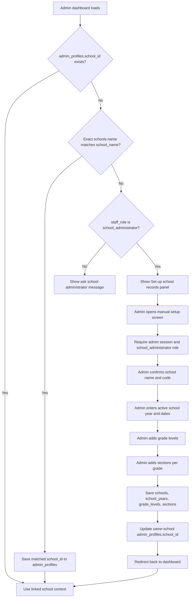

Database touchpoints:

- `admin_profiles`
- `schools`
- `school_years`
- `grade_levels`
- `sections`

### 3. Admin Student Creation And Enrollment

Implemented.

The school/admin side creates the official student record first. That student receives the `student_reference` that parents use for linking.

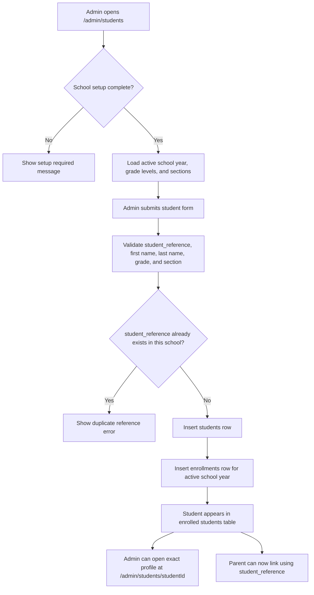

Database touchpoints:

- `students`
- `enrollments`
- `school_years`
- `grade_levels`
- `sections`

### 4. Admin Parent Directory

Implemented foundation.

The admin can see parent accounts that have linked students and parent accounts that are still pending because their student reference has not matched an official student yet.

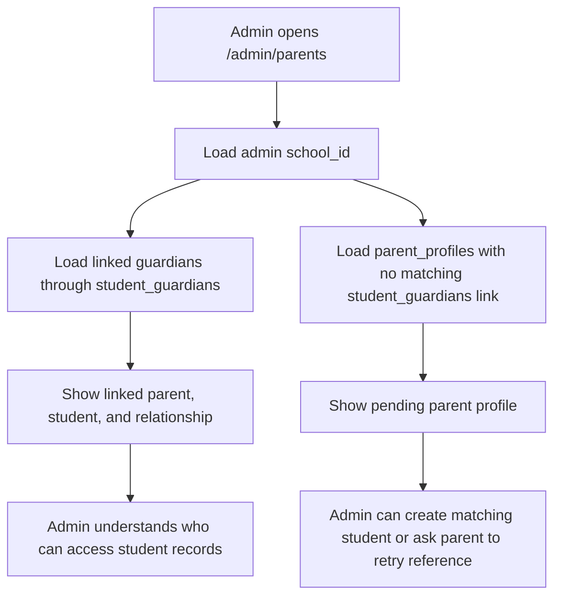

Database touchpoints:

- `users`
- `parent_profiles`
- `student_guardians`
- `students`
- `enrollments`

## Parent Portal Flow

### 1. Parent Registration And Automatic Student Linking

Implemented.

During registration, the parent submits a `student_reference`. If exactly one matching student exists, the system creates a `student_guardians` link immediately.

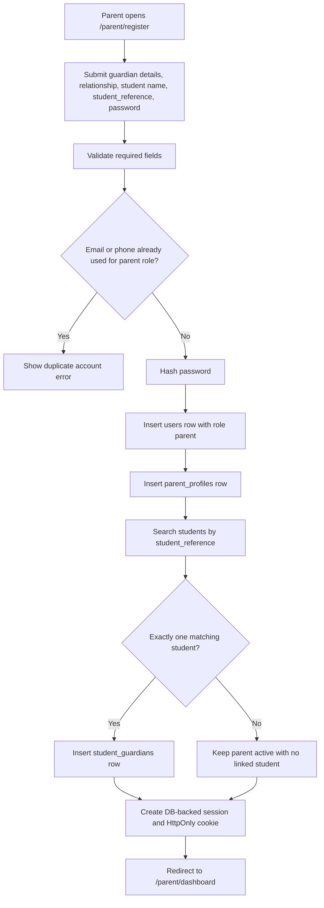

Database touchpoints:

- `users`
- `parent_profiles`
- `students`
- `student_guardians`

### 2. Parent Login And Dashboard Student Read

Implemented.

The parent dashboard must only show students linked to the signed-in parent through `student_guardians`.

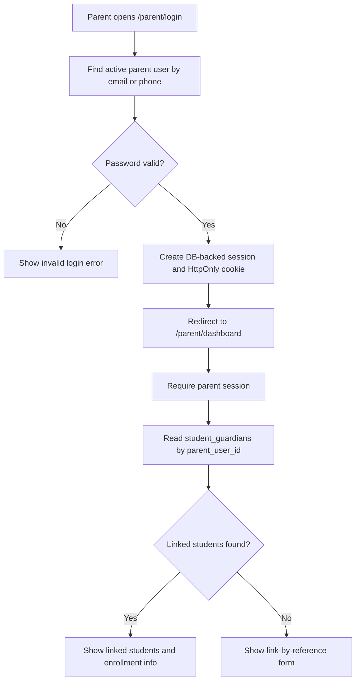

Database touchpoints:

- `users`
- `student_guardians`
- `students`
- `enrollments`
- `grade_levels`
- `sections`

### 3. Parent Manual Link By Reference

Implemented.

If parent registration did not find a student yet, the parent can retry from the parent dashboard after the school/admin creates the student.

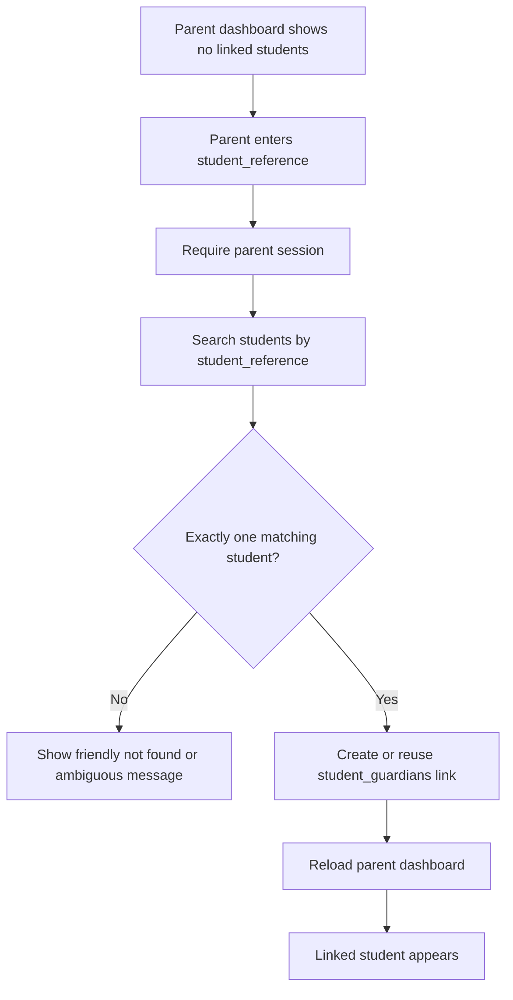

Database touchpoints:

- `students`
- `student_guardians`
- `parent_profiles`

## Cross-Portal Interaction Rule

Implemented.

The parent does not own a student just because they typed a student reference once. The real access rule is the database link in `student_guardians`.

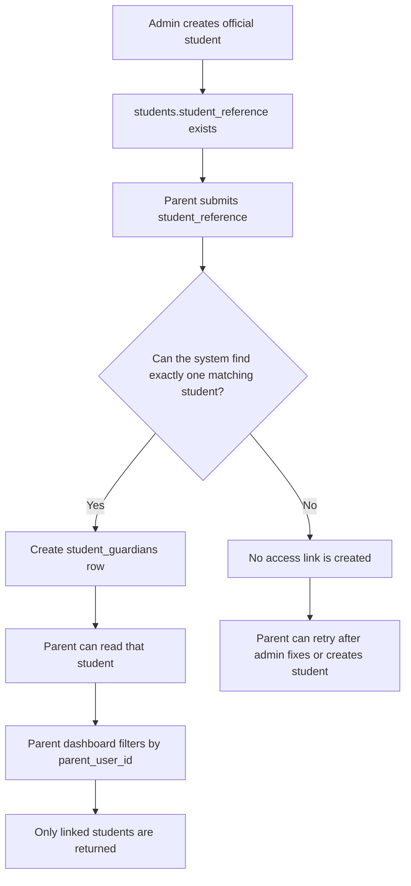

Access rule:

```text
Parent can view student data only when:
student_guardians.parent_user_id = signed_in_parent_user_id
and student_guardians.student_id = students.id
```

## Session Guard And Logout Flow

Implemented.

Both portals use the same `xmetapay_session` cookie, but the cookie only stores a random session token. The server stores the hashed token in `auth_sessions`, and role checks decide which dashboard is allowed.

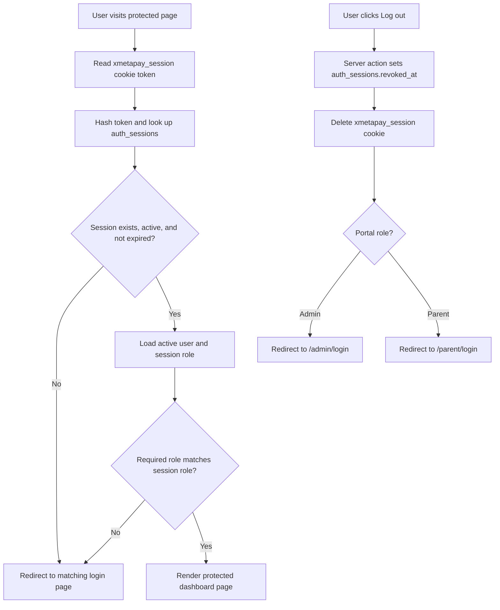

Database touchpoints:

- `users`
- `auth_sessions`
- `xmetapay_session` HttpOnly cookie containing only the raw random token

## Future Fees And Tuition Flow

Future.

This is the next major backend phase after the current student/guardian foundation.

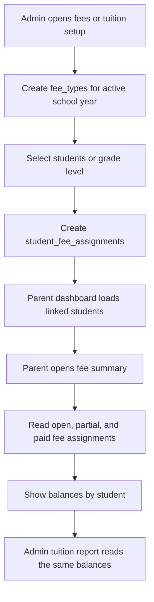

Database touchpoints:

- `fee_types`
- `student_fee_assignments`
- `students`
- `student_guardians`
- `school_years`

## Future Payment And Receipt Flow

Future.

For local MVP testing, payments can be recorded without a real payment gateway first. Real gateway integration can come later.

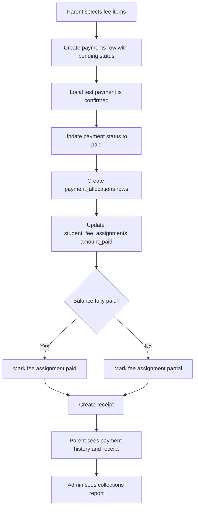

Database touchpoints:

- `payments`
- `payment_allocations`
- `receipts`
- `student_fee_assignments`
- `student_guardians`

## Future Wallet, Allowance, And Store Flow

Future.

Wallets should be separate from tuition payments so allowance and store/canteen spending can be tracked clearly.

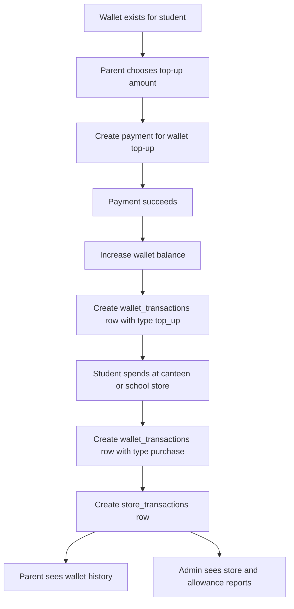

Database touchpoints:

- `wallets`
- `wallet_transactions`
- `store_merchants`
- `store_transactions`
- `payments`

## Practical Testing Flow

Use this testing order when checking the project manually in XAMPP:

1. Register an admin account.
2. Log in as admin.
3. Set up school records with the real school year, grade levels, and sections.
4. Create a student with a clear `student_reference`.
5. Confirm the student appears in the admin student table.
6. Register a parent account using the same `student_reference`.
7. Confirm the parent dashboard shows the linked student.
8. Log out as parent.
9. Log back in as parent and confirm the linked student is still there.
10. Log out as admin.
11. Log back in as admin and confirm the student and parent link are still visible.

## Safe Data Notes

- Do not commit `.env`.
- Do not commit real database exports.
- Do not commit real parent, student, school, payment, or credential data.
- Keep passwords stored only as `password_hash` in the database.
- Keep this document as a planning and explanation guide, not a seed-data file.
