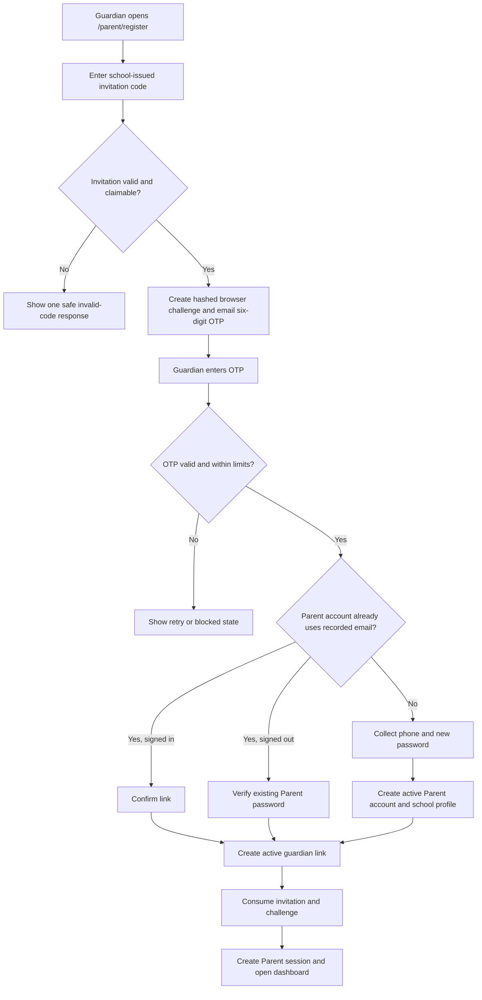

# Deferred Parent Invitation And Email OTP Blueprint

Status: Deferred after the September 11, 2026 rollback of PR #147.

This document preserves the intended school-issued Parent invitation workflow for a future implementation. It is a design reference, not a description of the currently active registration process.

## Current Behavior After Rollback

- `/parent/register` lets a guardian choose one active school, enter guardian details, select Mother, Father, or Guardian, submit one or more student references, and create an active Parent account.
- `parent_profiles.school_id` is validated and stored by the server. Every submitted student reference is matched only inside that school.
- Matching students are linked through `student_guardians`. An unmatched reference does not prevent account creation, and the Parent can try again later from the dashboard, My students, or the empty Student profile state.
- Parent registration does not send email and does not depend on Gmail or SMTP. SMTP remains required for password recovery and payment-reminder email delivery.

## Future Outcome

Replace public school selection and student-reference ownership claims with one school-issued invitation per guardian-to-student relationship. The school-recorded guardian email must receive both the invitation code and a separate one-time password before an account can be created or an existing same-school Parent account can gain access.

The future workflow must:

- Let only an authenticated `school_administrator` issue, resend, revoke, and manage invitations or guardian access.
- Bind each invitation to one active school, one exact student, one normalized guardian email, one guardian name, and one relationship.
- Prevent the browser from choosing school or student ownership during a claim.
- Support both new Parent accounts and active existing Parent accounts with the same email.
- Keep one Parent account restricted to one school while allowing a separate invitation for each additional child in that school.
- Make access revocation reversible without deleting accounts, guardian links, financial records, receipts, wallets, or audit history.
- Keep credentials, plaintext invitation codes, plaintext OTPs, and real user records out of committed files and logs.

## User And Admin Process

### 1. School administrator issues an invitation

1. The school administrator opens the exact Admin Student Profile.
2. The Parent invitations and access panel collects guardian name, guardian email, and relationship.
3. The server verifies that the actor is the school administrator for the student's active school.
4. The server rejects an existing relationship for the same student and email, or another unexpired invitation for that pair.
5. The server generates a formatted 16-character single-use claim code, stores only its keyed hash, and saves a seven-day expiry.
6. The invitation is committed before email delivery. Delivery moves from `queued` to `sent`, or to `failed` when SMTP delivery fails.
7. A failed or pending invitation can be resent. Resending rotates the claim code, extends expiry, and consumes any unfinished claim challenge.
8. An unused invitation can be revoked. A claimed guardian link is managed through the separate revoke/restore control with a required reason.

### 2. Guardian claims the invitation

The claim stages are `code`, `otp`, `account`, `login_required`, `ready`, `completed`, and `blocked`.

- `code`: accept only the invitation code. Do not accept school, student reference, guardian identity, or relationship from the browser.
- `otp`: send the OTP only to the invitation's school-recorded email and display only a masked address.
- `account`: after email verification, collect phone, password, and password confirmation for a new Parent.
- `login_required`: require the matching active Parent account password when the guardian is not already signed in as that user.
- `ready`: let the already authenticated matching Parent confirm the new link.
- `completed`: create the session if necessary and redirect to `/parent/dashboard`.
- `blocked`: stop completion for expired, revoked, consumed, disabled, cross-school, or rate-limited claims.

### 3. Completion transaction

Claim completion must run in one locked database transaction:

1. Re-read and lock the verified, unconsumed challenge and its invitation.
2. Confirm that the invitation, school, OTP verification, and completion window are still valid.
3. Create the Parent user and `parent_profiles` row, or verify the existing active Parent account.
4. Reject an existing Parent profile assigned to another school. A legacy profile with no school may be assigned only when its active guardian links do not conflict.
5. Reject a duplicate guardian relationship; restoration must remain an administrator action.
6. Insert the active `student_guardians` link and make it primary only when the student has no other active guardian.
7. Append a `granted` access event, mark the invitation claimed, consume the challenge, and commit.
8. Clear the claim cookie and establish the Parent session only after successful completion.

## Application Interfaces

The future implementation should restore these focused boundaries while keeping existing route destinations:

| Area | Interface or responsibility |
| --- | --- |
| Parent page | `/parent/register` renders the staged claim flow. |
| Parent server actions | Start, resend, verify, reset, refresh, complete-new, and complete-existing claim intents. |
| Admin Student Profile | Issue invitation, show delivery/state history, resend or revoke pending invitations, and revoke or restore claimed access. |
| Invitation service | Own validation, authorization, transactions, hashes, limits, state derivation, and safe errors. |
| Email service | Send escaped plain-text and responsive HTML invitation and OTP messages through the shared pooled SMTP transport. |
| Parent portal reads/writes | Require active `student_guardians` links so revocation takes effect immediately. |

Public state returned to the client should contain only the stage, safe message, masked email hint, display-safe guardian/school/student details, resend time, and field errors. Raw database rows, hashes, credentials, SMTP errors, and internal authorization details must remain server-only.

## Database Design

Reintroduce the schema additively and idempotently. Existing databases may already contain these objects from the earlier implementation, so the migration must check for each column, index, foreign key, and table before creating it.

### `student_guardians` additions

- `status ENUM('active', 'revoked') NOT NULL DEFAULT 'active'`
- `revoked_at DATETIME NULL`
- `revoked_by_user_id BIGINT UNSIGNED NULL`
- `revocation_reason VARCHAR(255) NULL`
- Index on `(parent_user_id, status, student_id)`
- Nullable revoker foreign key to `users`, using `ON DELETE SET NULL`

### `parent_guardian_invitations`

Store school and student ownership, normalized guardian identity, relationship, claim-code hash, issuer, seven-day expiry, delivery state, send limits, claim state, and revocation state. Index claim lookup and school/student history. Never store the plaintext claim code.

### `parent_claim_challenges`

Use one replaceable challenge per invitation. Store only the challenge-token hash and OTP hash, plus OTP expiry, resend cooldown, send-window counters, failed attempts, verification/completion times, and consumption time.

### `guardian_access_events`

Append `granted`, `revoked`, and `restored` events with the guardian link, school, optional invitation, actor, reason, and timestamp. Do not update or delete earlier audit events.

No future migration may delete existing Parent, student, guardian, payment, receipt, wallet, or audit records. Previously imported invitation objects can remain in place while this feature is deferred; the current application simply does not read them.

## Email And Security Rules

- Invitation lifetime: seven days.
- OTP lifetime: five minutes.
- Resend cooldown: 60 seconds.
- Send limit: five messages per rolling one-hour window for an invitation or claim challenge.
- OTP attempt limit: five failed attempts, then consume/block the challenge.
- Verified completion lifetime: ten minutes.
- Claim cookie lifetime: 15 minutes, `HttpOnly`, `SameSite=Lax`, secure in production, and scoped to `/parent`.
- Generate claim codes and OTPs with cryptographically secure randomness.
- Normalize invitation codes and emails before lookup. Use keyed SHA-256 hashes and timing-safe hash comparison.
- Return enumeration-safe invalid invitation and OTP messages. Log only safe diagnostics; never log codes, OTPs, passwords, SMTP credentials, or raw database errors.
- Commit invitation/challenge state before sending email. Record delivery failure without losing the invitation and allow a controlled retry.
- Keep the shared SMTP environment contract server-only. Gmail or Google Workspace deployments must use a Google App Password rather than the mailbox's normal password.
- Keep password recovery and payment-reminder SMTP behavior independent from the Parent invitation feature.

## Responsive And Accessible UX

- Use the existing public authentication shell and XMETA orange primary action styling in Light and Dark themes.
- Use one column on narrow screens and two columns only where account fields remain easy to scan.
- Keep inputs and primary buttons at least 48px high and other tap targets about 44px high.
- Stack resend, reset, sign-in, and submit actions on narrow mobile; place them side by side only when space permits.
- Preserve native labels and controls, visible keyboard focus, live regions for action feedback, and `aria-invalid` on fields with errors.
- Show progress without relying on color alone. Step labels may collapse on very small screens, but icons and accessible progress text must remain.
- Let the form scroll naturally and verify no horizontal overflow at 320px, 375px, 768px, and 1440px.

## Failure And Edge Cases

- Inactive school or missing student: do not issue or claim an invitation.
- Existing student/email relationship: direct the administrator to access controls instead of creating another invitation.
- Expired, revoked, claimed, malformed, or over-limit invitation: return the same safe invalid-code result.
- SMTP failure: preserve the invitation or invalidate the unusable OTP challenge, record safe diagnostics, and offer retry guidance.
- Disabled matching Parent account: block the claim and direct the guardian to the school.
- Existing Parent assigned to another school or conflicting legacy links: block completion without changing data.
- Duplicate completion, expired verification, or concurrent claim: row locks and final state checks must allow only one successful link.
- Revocation: hide the student and block new Parent operations immediately while preserving all historical records.

## Reimplementation Checklist

- [ ] Confirm SMTP delivery is configured and tested in the target environment without committing credentials.
- [ ] Restore the additive schema migration and synchronize canonical, production, explanatory, and visual schema files.
- [ ] Implement the server-only invitation service and escaped invitation/OTP email templates.
- [ ] Add authorized Admin invitation and guardian-access actions to the exact Student Profile.
- [ ] Replace Parent self-registration with the staged claim flow while preserving login and route destinations.
- [ ] Apply active-link filtering to every Parent student, fee, tuition, payment, receipt, archive, wallet, and top-up read/write.
- [ ] Update README, role documentation, checklist, project flowcharts, and browser visual plans together.
- [ ] Add focused unit coverage for authorization, hashes, limits, transactions, school isolation, account branching, and safe errors.
- [ ] Add end-to-end coverage for issue, resend, revoke, OTP verification, new/existing account completion, additional children, and access restore.
- [ ] Run lint, unit tests, production build, and Playwright tests.
- [ ] Browser-check Light and Dark themes at 320px, 375px, 768px, and 1440px, including keyboard focus and overflow metrics.

## Acceptance Criteria

- A guardian cannot create or link Parent access by submitting a school ID or student reference from the browser.
- Only the correct school's administrator can issue or manage an invitation for that school's student.
- The recorded email must complete a separate OTP check before account creation or student linking.
- New and existing active Parent accounts can claim invitations without crossing the immutable school boundary.
- Each invitation can produce at most one guardian link, and concurrent or repeated completion is safe.
- Revoked access immediately disappears from Parent operations and can be restored without data loss.
- SMTP failures produce actionable, non-sensitive feedback and do not affect password recovery or payment-reminder behavior.
- Documentation, schema sources, visual plans, tests, and responsive behavior agree with the implemented workflow before it is marked complete.
